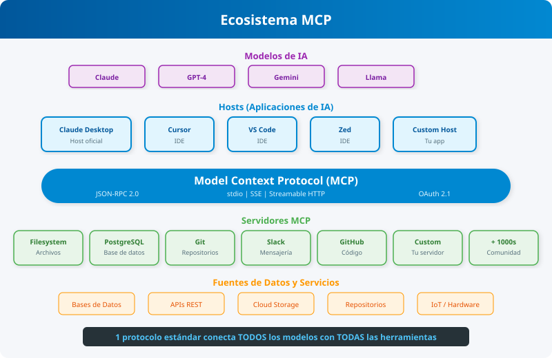
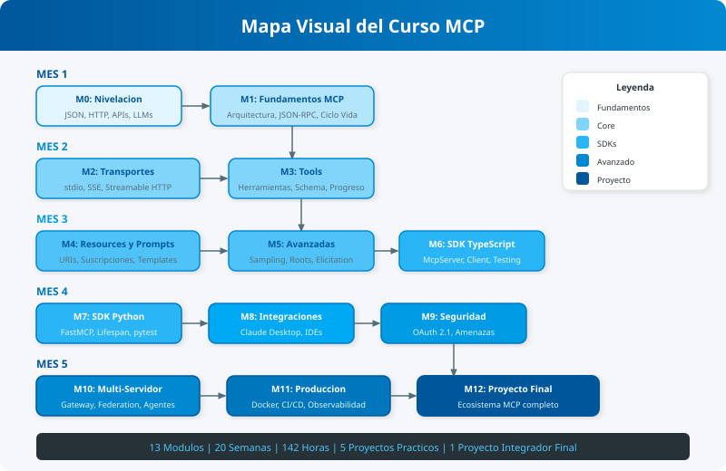

# Curso: Model Context Protocol (MCP) - De Cero a Experto

## Descripción

Este curso integral está diseñado para enseñar a desarrolladores, ingenieros de IA y arquitectos de software cómo dominar el Model Context Protocol (MCP). Desde los fundamentos del protocolo hasta la implementación de servidores complejos, mecanismos de seguridad y arquitecturas multi-agente, este curso cubre todo lo necesario para construir un ecosistema de herramientas robusto para LLMs.

## Objetivos del Curso

- **Comprender** la arquitectura y filosofía de MCP.
- **Implementar** servidores MCP en TypeScript y Python.
- **Diseñar** herramientas, recursos y prompts efectivos.
- **Asegurar** la comunicación mediante autenticación y mejores prácticas.
- **Integrar** servidores MCP en flujos de trabajo con Claude Desktop e IDEs.
- **Construir** arquitecturas complejas con múltiples servidores y gateways.

## Documentos Generales del Curso

| Documento                                        | Descripción                                                          |
| :----------------------------------------------- | :------------------------------------------------------------------- |
| [Plan Curricular](plan_curricular.md)            | Arquitectura modular, objetivos y estructura pedagógica detallada    |
| [Pensum de Competencias](pensum_competencias.md) | Matriz de competencias, resultados de aprendizaje y perfil de egreso |
| [Cronograma](cronograma.md)                      | Calendario semanal de 20 semanas con horas por actividad             |
| [Diagramas](diagramas/README.md)                 | Índice de todos los diagramas SVG del curso                          |

## Estructura del Curso

El curso está dividido en 14 módulos progresivos (Módulo 0 al Módulo 13):

|      Módulo      | Título                                | Contenido                                                        |
| :--------------: | :------------------------------------ | :--------------------------------------------------------------- |
|  [0](modulo_0/)  | Diagnóstico y Nivelación              | JSON, HTTP, APIs REST, entorno de desarrollo                     |
|  [1](modulo_1/)  | Fundamentos del Protocolo MCP         | Arquitectura Host/Client/Server, JSON-RPC 2.0, ciclo de vida     |
|  [2](modulo_2/)  | Mecanismos de Transporte              | stdio, SSE, Streamable HTTP, selección de transporte             |
|  [3](modulo_3/)  | Primitivas Core — Tools               | Anatomía, anotaciones, structured output, herramientas dinámicas |
|  [4](modulo_4/)  | Primitivas Core — Resources y Prompts | URI templates, suscripciones, prompts parametrizables            |
|  [5](modulo_5/)  | Primitivas Avanzadas                  | Sampling, Roots, elicitation, logging y progreso                 |
|  [6](modulo_6/)  | SDK de TypeScript                     | APIs de alto/bajo nivel, cliente multi-servidor, testing         |
|  [7](modulo_7/)  | SDK de Python                         | FastMCP, decoradores, lifecycle, composición de servidores       |
|  [8](modulo_8/)  | Integraciones y Hosts                 | Claude Desktop, IDEs, frameworks de agentes, host personalizado  |
|  [9](modulo_9/)  | Seguridad y Autorización              | OAuth 2.1, mitigación de amenazas, auditoría de 20 puntos        |
| [10](modulo_10/) | Arquitecturas Avanzadas               | Gateway, federation, agentes autónomos, ecosistema comunitario   |
| [11](modulo_11/) | MCP en Producción                     | Contenedores, observabilidad, CI/CD, versionado                  |
| [12](modulo_12/) | Proyecto Integrador Final             | "Ecosistema de Operaciones Inteligentes" — proyecto completo     |
| [13](modulo_13/) | Apéndice y Referencia                 | Glosario de términos MCP, recursos adicionales                   |

## Requisitos Previos

- Conocimientos básicos de programación (Python o JavaScript/TypeScript).
- Familiaridad con la línea de comandos.
- Conceptos básicos de APIs REST y JSON.

## Cómo Usar Este Curso

Sigue los módulos en orden. Cada tema incluye teoría y ejercicios prácticos. Se recomienda completar los proyectos prácticos al final de cada sección principal.

---

> **Generado por Teach-Laoz AI Agents - 2026**
