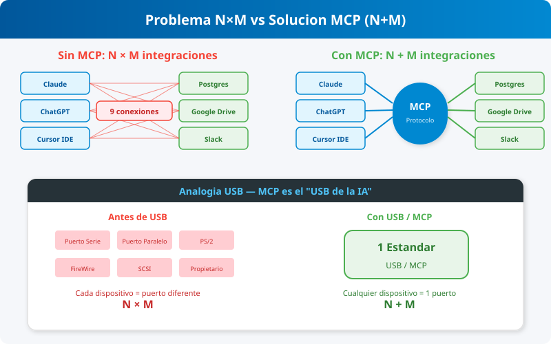

# Subtema 1.1.2: El Problema N×M y la Propuesta de Valor de MCP

## La Analogía del USB

Imagina si cada marca de impresora necesitara un puerto físico diferente en tu computadora.

- HP necesita un puerto redondo.
- Epson necesita un puerto triangular.
- Canon necesita un puerto cuadrado.

Si compraras una nueva computadora, tendrías que asegurarte de que tuviera los puertos exactos para tus dispositivos. Esto es insostenible.

**Solución:** USB (Universal Serial Bus). Un puerto estándar. Cualquier dispositivo USB funciona con cualquier computadora con puerto USB.

## El Problema N×M en IA

Sin MCP, tenemos:

- **N** Aplicaciones de IA (Claude, ChatGPT, IDEs, Agentes).
- **M** Fuentes de Datos (Postgres, Drive, Slack, Git).

Para conectarlos todos, necesitamos **N × M** integraciones individuales.

- 3 IAs × 3 Fuentes = 9 Integraciones.
- 10 IAs × 10 Fuentes = 100 Integraciones.

Esto fragmenta el ecosistema. Los desarrolladores de herramientas no pueden mantener 10 versiones de su código.

## La Solución MCP: 1 Integración para Todo

MCP actúa como el "USB para aplicaciones de IA".

- **Desarrolladores de Fuentes:** Escriben un **Servidor MCP** una sola vez.
- **Desarrolladores de IA:** Escriben un **Cliente MCP (Host)** una sola vez.

Resultado:

- Cualquier IA compatible con MCP puede usar instantáneamente cualquier Servidor MCP.
- Complejidad reducida de **N × M** a **N + M**.

Esto desbloquea un efecto de red masivo donde las nuevas herramientas benefician a todos los modelos simultáneamente.
