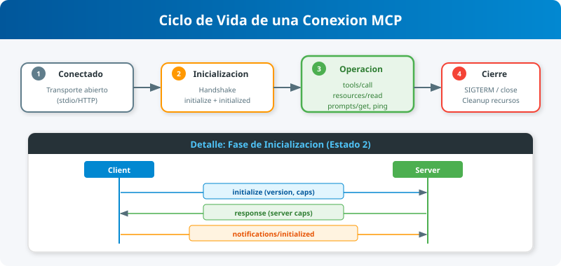
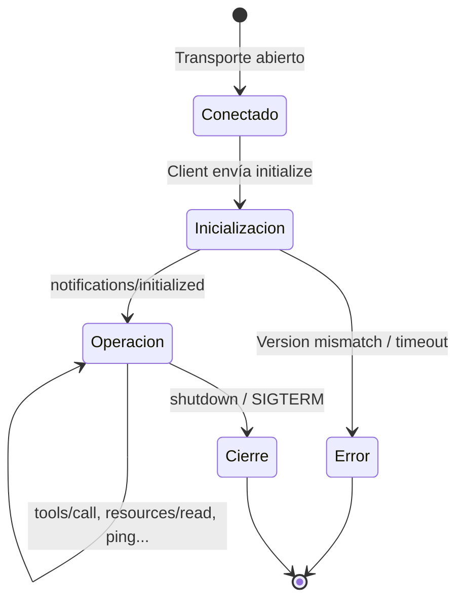

# Subtema 1.2.3: Ciclo de Vida de una Conexión MCP

Una conexión MCP no es caótica; sigue un diagrama de estados estricto para garantizar que ambos lados estén sincronizados.

## Diagrama de Estados

1. **Conexión Iniciada:** El transporte (stdio / SSE) se establece. Aún no se pueden enviar mensajes de lógica de negocio.
2. **Inicialización (Initialization):**
   - Cliente envía `initialize`.
   - Servidor responde con sus capacidades.
   - Cliente envía `notifications/initialized`.
3. **Operación (Running):**
   - Ahora es seguro enviar `tools/list`, `resources/read`, `ping`, etc.
   - Cualquier mensaje enviado antes de este estado resultaría en un error.
4. **Cierre (Shutdown):**
   - Cualquiera de las partes decide cerrar.
   - Si es ordenado, se envían señales de terminación.

## Errores Comunes en el Ciclo de Vida

### 1. Olvidar `notifications/initialized`

Si estás programando un cliente MCP manualmente y olvidas enviar esta notificación final, el servidor (especialmente si usa los SDKs oficiales) se quedará esperando eternamente y rechazará tus llamadas a herramientas.

### 2. Version Mismatch

Si el cliente habla versión `2024-11-05` y el servidor una versión incompatible muy antigua (o muy nueva con breaking changes), el handshake fallará y la conexión se cerrará.

### 3. Timeout en Inicialización

Los clientes suelen tener un tiempo de espera (ej: 10 segundos) para recibir la respuesta al `initialize`. Si tu servidor tarda mucho en arrancar (ej: cargando modelos pesados en memoria antes de responder), el cliente podría desconectarse.

> **Tip:** Responde al `initialize` rápido. Si necesitas cargar cosas pesadas, hazlo de forma asíncrona _después_ o reporta que estás listo pero carga "lazy".
