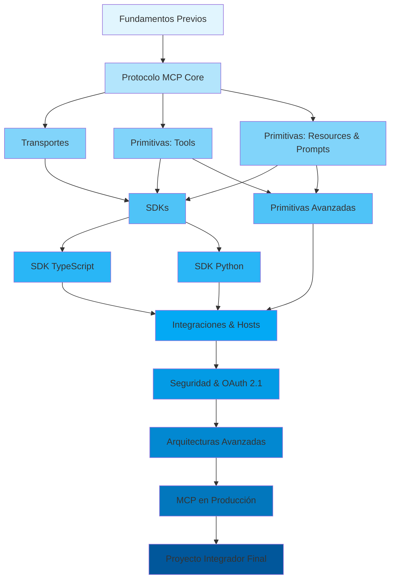

# ARQUITECTURA CURRICULAR: Model Context Protocol (MCP) - De Cero a Experto

## METADATA

- **Complejidad**: Alta
- **Duración estimada**: 130 horas (teoría: 45h, práctica: 55h, proyectos: 30h)
- **Audiencia objetivo**: Desarrolladores de Software con experiencia básica en programación
- **Prerrequisitos obligatorios**:
  1. Programación en al menos un lenguaje (Python o TypeScript preferido)
  2. Conocimientos básicos de HTTP y APIs REST
  3. Familiaridad con línea de comandos (terminal/shell)
  4. Conceptos básicos de JSON
- **Fecha de diseño**: 2026-02-08

## MAPA CONCEPTUAL



## OBJETIVOS GENERALES DEL CURSO

1. **Diseñar e implementar** servidores MCP completos que expongan herramientas, recursos y prompts a aplicaciones de IA, cumpliendo con la especificación oficial.
2. **Construir clientes MCP** capaces de descubrir, negociar capacidades y consumir servicios de múltiples servidores MCP simultáneamente.
3. **Aplicar el modelo de seguridad** de MCP incluyendo OAuth 2.1, validación de entradas, y mitigación de amenazas como tool poisoning y prompt injection.
4. **Arquitectar sistemas multi-servidor** con patrones de gateway, orquestación de agentes y despliegue en producción con observabilidad completa.
5. **Evaluar y seleccionar** transportes, SDKs y patrones de integración apropiados según los requisitos del sistema, justificando decisiones con criterios técnicos medibles.

## ESTRUCTURA MODULAR

---

### MODULO 0: Diagnóstico y Nivelación

**Duración**: 8 horas
**Objetivo**: Validar y nivelar los conocimientos previos necesarios para abordar el protocolo MCP con solidez técnica.

#### TEMA 0.1: Fundamentos de Comunicación entre Procesos

**Objetivo del Tema**: Comprender los mecanismos fundamentales de IPC y protocolos de comunicación que sustentan MCP.

- **[Subtema 0.1.1](modulo_0/tema_0.1/subtema_0.1.1.md)**: JSON como Formato de Intercambio de Datos
  - Objetivo: Parsear y construir estructuras JSON complejas incluyendo tipos anidados, arrays y validación de esquemas.
  - Tipo: Mixto
  - Requiere Código: Sí

- **[Subtema 0.1.2](modulo_0/tema_0.1/subtema_0.1.2.md)**: HTTP: Métodos, Headers y Ciclo Request-Response
  - Objetivo: Describir el flujo completo de una petición HTTP incluyendo métodos, status codes, headers y body.
  - Tipo: Teórico
  - Requiere Código: No

- **[Subtema 0.1.3](modulo_0/tema_0.1/subtema_0.1.3.md)**: APIs REST: Diseño y Consumo
  - Objetivo: Consumir APIs REST usando herramientas de línea de comandos y código, interpretando respuestas correctamente.
  - Tipo: Mixto
  - Requiere Código: Sí

#### TEMA 0.2: Fundamentos de IA Generativa y LLMs

**Objetivo del Tema**: Entender el contexto tecnológico en el que opera MCP y por qué es necesario.

- **[Subtema 0.2.1](modulo_0/tema_0.2/subtema_0.2.1.md)**: Qué Son los Modelos de Lenguaje (LLMs)
  - Objetivo: Explicar qué es un LLM, cómo genera texto y cuáles son sus limitaciones fundamentales (alucinaciones, corte de conocimiento, falta de acceso a herramientas).
  - Tipo: Teórico
  - Requiere Código: No

- **[Subtema 0.2.2](modulo_0/tema_0.2/subtema_0.2.2.md)**: El Problema de la Integración: Por Qué los LLMs Necesitan Herramientas
  - Objetivo: Identificar las limitaciones de los LLMs aislados y explicar por qué se requieren protocolos de integración como MCP.
  - Tipo: Teórico
  - Requiere Código: No

- **[Subtema 0.2.3](modulo_0/tema_0.2/subtema_0.2.3.md)**: Panorama de Soluciones: Function Calling, Tool Use y Protocolos Abiertos
  - Objetivo: Comparar las aproximaciones existentes para conectar LLMs con herramientas externas, identificando ventajas y limitaciones de cada una.
  - Tipo: Teórico
  - Requiere Código: No

#### TEMA 0.3: Entorno de Desarrollo

**Objetivo del Tema**: Configurar un entorno de desarrollo completo para trabajar con MCP durante todo el curso.

- **[Subtema 0.3.1](modulo_0/tema_0.3/subtema_0.3.1.md)**: Instalación de Node.js, Python y Gestores de Paquetes
  - Objetivo: Instalar y configurar Node.js (v18+), Python (3.10+), npm, pip y uv en el sistema operativo del estudiante.
  - Tipo: Práctico
  - Requiere Código: Sí

- **[Subtema 0.3.2](modulo_0/tema_0.3/subtema_0.3.2.md)**: IDEs y Extensiones Recomendadas
  - Objetivo: Configurar VS Code con las extensiones necesarias para desarrollo MCP (TypeScript, Python, JSON Schema validator).
  - Tipo: Práctico
  - Requiere Código: No

- **[Subtema 0.3.3](modulo_0/tema_0.3/subtema_0.3.3.md)**: Primer Contacto con Claude Desktop y MCP Inspector
  - Objetivo: Instalar Claude Desktop y MCP Inspector, verificando la conectividad básica con un servidor MCP de ejemplo.
  - Tipo: Práctico
  - Requiere Código: Sí

#### Ruta Básica

- Completar todos los temas y subtemas con ejercicios guiados paso a paso.

#### Ruta Intermedia

- Omitir Temas 0.1 y 0.2; completar solo Tema 0.3 (entorno de desarrollo).

#### Ruta Avanzada

- Omitir módulo completo; verificar entorno con checklist de autodiagnóstico de 15 minutos.

---

### MODULO 1: Fundamentos del Protocolo MCP

**Duración**: 12 horas
**Objetivo**: Comprender la arquitectura, filosofía de diseño y modelo de comunicación del protocolo MCP, incluyendo el ciclo de vida completo de una conexión.

#### TEMA 1.1: Origen y Filosofía de MCP

**Objetivo del Tema**: Contextualizar MCP dentro del ecosistema de IA y comprender las decisiones de diseño que motivaron su creación.

- **[Subtema 1.1.1](modulo_1/tema_1.1/subtema_1.1.1.md)**: Historia de MCP: De Anthropic al Estándar Abierto
  - Objetivo: Narrar la evolución de MCP desde su lanzamiento por Anthropic en noviembre 2024 hasta su donación a la Linux Foundation y adopción por la industria.
  - Tipo: Teórico
  - Requiere Código: No

- **[Subtema 1.1.2](modulo_1/tema_1.1/subtema_1.1.2.md)**: El Problema N×M y la Propuesta de Valor de MCP
  - Objetivo: Explicar cómo MCP resuelve el problema de integración N aplicaciones × M herramientas mediante un protocolo estandarizado, usando la analogía del puerto USB.
  - Tipo: Teórico
  - Requiere Código: No

- **[Subtema 1.1.3](modulo_1/tema_1.1/subtema_1.1.3.md)**: Principios de Diseño: Localidad, Seguridad y Composabilidad
  - Objetivo: Enumerar y explicar los principios fundamentales de diseño de MCP incluyendo server locality, user consent, y composability.
  - Tipo: Teórico
  - Requiere Código: No

#### TEMA 1.2: Arquitectura del Protocolo

**Objetivo del Tema**: Dominar los roles y responsabilidades de cada componente en la arquitectura MCP.

- **[Subtema 1.2.1](modulo_1/tema_1.2/subtema_1.2.1.md)**: Los Tres Roles: Host, Client y Server
  - Objetivo: Diferenciar las responsabilidades de Host (aplicación de IA), Client (conector de protocolo) y Server (proveedor de capacidades) con diagramas de interacción.
  - Tipo: Teórico
  - Requiere Código: No

- **[Subtema 1.2.2](modulo_1/tema_1.2/subtema_1.2.2.md)**: Negociación de Capacidades (Capability Negotiation)
  - Objetivo: Implementar el handshake de inicialización entre client y server describiendo el intercambio de capabilities, protocol version y server info.
  - Tipo: Mixto
  - Requiere Código: Sí

- **[Subtema 1.2.3](modulo_1/tema_1.2/subtema_1.2.3.md)**: Ciclo de Vida de una Conexión MCP
  - Objetivo: Trazar el flujo completo de una conexión MCP desde initialize hasta shutdown, incluyendo los estados intermedios y posibles errores.
  - Tipo: Mixto
  - Requiere Código: Sí

#### TEMA 1.3: JSON-RPC 2.0 como Capa de Mensajería

**Objetivo del Tema**: Dominar el formato de mensajes JSON-RPC 2.0 tal como lo usa MCP.

- **[Subtema 1.3.1](modulo_1/tema_1.3/subtema_1.3.1.md)**: Anatomía de un Mensaje JSON-RPC: Request, Response, Notification
  - Objetivo: Construir manualmente mensajes JSON-RPC válidos para requests (con id), responses (result/error) y notifications (sin id), aplicando la especificación 2.0.
  - Tipo: Mixto
  - Requiere Código: Sí

- **[Subtema 1.3.2](modulo_1/tema_1.3/subtema_1.3.2.md)**: Métodos del Protocolo MCP: El Catálogo Completo
  - Objetivo: Clasificar los 30+ métodos del protocolo MCP por categoría (lifecycle, tools, resources, prompts, sampling, etc.) describiendo la firma de cada uno.
  - Tipo: Teórico
  - Requiere Código: No

- **[Subtema 1.3.3](modulo_1/tema_1.3/subtema_1.3.3.md)**: Manejo de Errores: Códigos Estándar y Personalizados
  - Objetivo: Implementar manejo de errores robusto usando los códigos de error estándar de JSON-RPC (-32700, -32600, etc.) y los códigos específicos de MCP.
  - Tipo: Práctico
  - Requiere Código: Sí

#### TEMA 1.4: Versiones de la Especificación

**Objetivo del Tema**: Comprender la evolución de la especificación MCP y las diferencias entre versiones.

- **[Subtema 1.4.1](modulo_1/tema_1.4/subtema_1.4.1.md)**: Especificación 2024-11-05: La Base Fundacional
  - Objetivo: Describir las capacidades y limitaciones de la primera versión estable de la especificación MCP.
  - Tipo: Teórico
  - Requiere Código: No

- **[Subtema 1.4.2](modulo_1/tema_1.4/subtema_1.4.2.md)**: Especificación 2025-03-26: Streamable HTTP y OAuth
  - Objetivo: Identificar los cambios introducidos en la segunda versión mayor incluyendo Streamable HTTP transport, OAuth 2.1 y mejoras en herramientas.
  - Tipo: Teórico
  - Requiere Código: No

- **[Subtema 1.4.3](modulo_1/tema_1.4/subtema_1.4.3.md)**: Especificación 2025-06-18: Elicitation, Audio y JSON Output
  - Objetivo: Analizar las adiciones de la tercera versión incluyendo elicitation, soporte para audio y structured output en herramientas.
  - Tipo: Teórico
  - Requiere Código: No

#### Ruta Básica

- Todos los temas con ejercicios de construcción manual de mensajes JSON-RPC.

#### Ruta Intermedia

- Omitir Tema 1.1 (lectura sugerida); profundizar en Temas 1.2-1.4 con ejercicios de implementación.

#### Ruta Avanzada

- Lectura rápida de Temas 1.1-1.3; foco en Tema 1.4 y análisis comparativo entre versiones de especificación.

---

### MODULO 2: Mecanismos de Transporte

**Duración**: 10 horas
**Objetivo**: Implementar y configurar los tres mecanismos de transporte soportados por MCP, seleccionando el apropiado según el contexto de despliegue.

#### TEMA 2.1: Transporte stdio (Standard I/O)

**Objetivo del Tema**: Implementar comunicación MCP sobre stdin/stdout para servidores locales.

- **[Subtema 2.1.1](modulo_2/tema_2.1/subtema_2.1.1.md)**: Modelo de Comunicación: stdin/stdout como Canal Bidireccional
  - Objetivo: Explicar cómo MCP utiliza stdin para recibir mensajes y stdout para enviarlos, con stderr reservado para logging, incluyendo el delimitador de mensajes (newline).
  - Tipo: Mixto
  - Requiere Código: Sí

- **[Subtema 2.1.2](modulo_2/tema_2.1/subtema_2.1.2.md)**: Implementación de un Servidor stdio Desde Cero
  - Objetivo: Construir un servidor MCP funcional que lea de stdin y escriba a stdout procesando mensajes JSON-RPC línea por línea.
  - Tipo: Práctico
  - Requiere Código: Sí

- **[Subtema 2.1.3](modulo_2/tema_2.1/subtema_2.1.3.md)**: Gestión de Procesos y Ciclo de Vida en stdio
  - Objetivo: Implementar la gestión correcta del proceso hijo incluyendo spawn, señales de terminación (SIGTERM/SIGINT) y cleanup de recursos.
  - Tipo: Práctico
  - Requiere Código: Sí

#### TEMA 2.2: Transporte HTTP con Server-Sent Events (SSE)

**Objetivo del Tema**: Implementar el transporte HTTP+SSE para servidores MCP remotos (legacy).

- **[Subtema 2.2.1](modulo_2/tema_2.2/subtema_2.2.1.md)**: Server-Sent Events: Fundamentos y Flujo Unidireccional
  - Objetivo: Describir el protocolo SSE incluyendo el formato de eventos, reconexión automática y su rol como canal server-to-client en MCP.
  - Tipo: Mixto
  - Requiere Código: Sí

- **[Subtema 2.2.2](modulo_2/tema_2.2/subtema_2.2.2.md)**: Arquitectura Dual: Endpoint SSE + Endpoint POST
  - Objetivo: Implementar un servidor HTTP que exponga un endpoint SSE para mensajes server-to-client y un endpoint POST para mensajes client-to-server.
  - Tipo: Práctico
  - Requiere Código: Sí

- **[Subtema 2.2.3](modulo_2/tema_2.2/subtema_2.2.3.md)**: Limitaciones del Transporte SSE y Motivación para Streamable HTTP
  - Objetivo: Analizar las limitaciones de SSE (unidireccional, no soporta resumability nativa, requiere dos conexiones) y por qué se diseñó Streamable HTTP.
  - Tipo: Teórico
  - Requiere Código: No

#### TEMA 2.3: Transporte Streamable HTTP

**Objetivo del Tema**: Dominar el transporte moderno de MCP para comunicación remota con soporte de streaming bidireccional.

- **[Subtema 2.3.1](modulo_2/tema_2.3/subtema_2.3.1.md)**: Arquitectura de Streamable HTTP: Un Solo Endpoint, Múltiples Modos
  - Objetivo: Explicar cómo Streamable HTTP unifica la comunicación en un solo endpoint que soporta POST regular, POST con SSE streaming y GET para server-initiated streams.
  - Tipo: Mixto
  - Requiere Código: Sí

- **[Subtema 2.3.2](modulo_2/tema_2.3/subtema_2.3.2.md)**: Gestión de Sesiones: Mcp-Session-Id y Estado del Servidor
  - Objetivo: Implementar la gestión de sesiones MCP incluyendo la creación, validación y terminación de session IDs via headers HTTP.
  - Tipo: Práctico
  - Requiere Código: Sí

- **[Subtema 2.3.3](modulo_2/tema_2.3/subtema_2.3.3.md)**: Resumability y Reconexión con Last-Event-ID
  - Objetivo: Implementar soporte de reconexión usando el header Last-Event-ID para que clientes puedan reanudar streams interrumpidos sin pérdida de mensajes.
  - Tipo: Práctico
  - Requiere Código: Sí

- **[Subtema 2.3.4](modulo_2/tema_2.3/subtema_2.3.4.md)**: Compatibilidad Retroactiva: Soporte Dual SSE y Streamable HTTP
  - Objetivo: Configurar un servidor que soporte simultáneamente clientes legacy (SSE) y modernos (Streamable HTTP) usando content negotiation.
  - Tipo: Práctico
  - Requiere Código: Sí

#### TEMA 2.4: Selección de Transporte y Patrones de Despliegue

**Objetivo del Tema**: Evaluar y seleccionar el transporte apropiado según los requisitos del sistema.

- **[Subtema 2.4.1](modulo_2/tema_2.4/subtema_2.4.1.md)**: Matriz de Decisión: stdio vs SSE vs Streamable HTTP
  - Objetivo: Construir una matriz de decisión basada en criterios de localidad, latencia, escalabilidad, seguridad y complejidad de implementación para seleccionar el transporte apropiado.
  - Tipo: Teórico
  - Requiere Código: No

- **[Subtema 2.4.2](modulo_2/tema_2.4/subtema_2.4.2.md)**: Patrones de Proxy y Tunneling para MCP Remoto
  - Objetivo: Diseñar arquitecturas de proxy que exponen servidores stdio locales como servidores HTTP remotos, incluyendo autenticación y rate limiting.
  - Tipo: Mixto
  - Requiere Código: Sí

#### Ruta Básica

- Todos los temas con énfasis en stdio (Tema 2.1) y Streamable HTTP básico (Tema 2.3.1-2.3.2).

#### Ruta Intermedia

- Omitir Subtema 2.2.1 (SSE fundamentos); implementar todos los transportes con ejercicios comparativos.

#### Ruta Avanzada

- Foco en Temas 2.3 y 2.4; implementar proxy de transporte completo como ejercicio.

---

### MODULO 3: Primitivas Core - Tools (Herramientas)

**Duración**: 12 horas
**Objetivo**: Diseñar, implementar y consumir herramientas MCP robustas con validación de esquemas, manejo de errores y anotaciones semánticas.

#### TEMA 3.1: Anatomía de una Herramienta MCP

**Objetivo del Tema**: Comprender la estructura completa de una herramienta MCP desde su definición hasta su invocación.

- **[Subtema 3.1.1](modulo_3/tema_3.1/subtema_3.1.1.md)**: Definición de Herramientas: name, description e inputSchema
  - Objetivo: Definir herramientas MCP completas especificando nombre, descripción orientada al modelo y esquema de entrada JSON Schema con validación de tipos.
  - Tipo: Mixto
  - Requiere Código: Sí

- **[Subtema 3.1.2](modulo_3/tema_3.1/subtema_3.1.2.md)**: Descubrimiento: El Flujo tools/list y Paginación
  - Objetivo: Implementar el endpoint tools/list con soporte de cursor-based pagination para servidores con gran cantidad de herramientas.
  - Tipo: Práctico
  - Requiere Código: Sí

- **[Subtema 3.1.3](modulo_3/tema_3.1/subtema_3.1.3.md)**: Invocación: El Flujo tools/call y Tipos de Contenido de Respuesta
  - Objetivo: Implementar el handler de tools/call devolviendo resultados en formatos text, image y embedded resource, con manejo correcto de isError.
  - Tipo: Práctico
  - Requiere Código: Sí

#### TEMA 3.2: Herramientas Avanzadas

**Objetivo del Tema**: Implementar patrones avanzados de herramientas incluyendo operaciones destructivas, anotaciones y notificaciones de cambio.

- **[Subtema 3.2.1](modulo_3/tema_3.2/subtema_3.2.1.md)**: Anotaciones de Herramientas: readOnlyHint, destructiveHint, openWorldHint
  - Objetivo: Aplicar anotaciones semánticas a herramientas para que los hosts puedan tomar decisiones informadas sobre consentimiento del usuario y políticas de ejecución.
  - Tipo: Mixto
  - Requiere Código: Sí

- **[Subtema 3.2.2](modulo_3/tema_3.2/subtema_3.2.2.md)**: Structured Output: outputSchema y Resultados Tipados
  - Objetivo: Definir esquemas de salida para herramientas que requieren resultados estructurados procesables por el cliente, usando outputSchema con JSON Schema.
  - Tipo: Práctico
  - Requiere Código: Sí

- **[Subtema 3.2.3](modulo_3/tema_3.2/subtema_3.2.3.md)**: Notificaciones de Cambio: tools/list_changed
  - Objetivo: Implementar actualización dinámica del catálogo de herramientas notificando al cliente cuando se agregan, modifican o eliminan herramientas en tiempo de ejecución.
  - Tipo: Práctico
  - Requiere Código: Sí

#### TEMA 3.3: Patrones de Diseño de Herramientas

**Objetivo del Tema**: Aplicar buenas prácticas en el diseño de herramientas MCP para maximizar usabilidad y seguridad.

- **[Subtema 3.3.1](modulo_3/tema_3.3/subtema_3.3.1.md)**: Granularidad: Herramientas Atómicas vs Herramientas Compuestas
  - Objetivo: Evaluar la granularidad apropiada de herramientas comparando diseños atómicos (una operación) versus compuestos (múltiples operaciones), identificando trade-offs de descubribilidad y complejidad.
  - Tipo: Teórico
  - Requiere Código: No

- **[Subtema 3.3.2](modulo_3/tema_3.3/subtema_3.3.2.md)**: Validación de Entrada y Sanitización para Seguridad
  - Objetivo: Implementar validación exhaustiva de entradas en herramientas MCP previniendo inyección de comandos, path traversal y otros ataques OWASP Top 10.
  - Tipo: Práctico
  - Requiere Código: Sí

- **[Subtema 3.3.3](modulo_3/tema_3.3/subtema_3.3.3.md)**: Herramientas de Larga Duración y Reporte de Progreso
  - Objetivo: Implementar herramientas que reportan progreso incremental usando notifications/progress para operaciones que tardan más de unos segundos.
  - Tipo: Práctico
  - Requiere Código: Sí

- **[Subtema 3.3.4](modulo_3/tema_3.3/subtema_3.3.4.md)**: Proyecto Práctico: Servidor MCP de Gestión de Base de Datos
  - Objetivo: Construir un servidor MCP completo que exponga operaciones CRUD sobre una base de datos SQLite con herramientas para query, insert, update y schema inspection.
  - Tipo: Práctico
  - Requiere Código: Sí

#### Ruta Básica

- Todos los temas con proyecto guiado paso a paso.

#### Ruta Intermedia

- Omitir Subtema 3.3.1; proyecto con especificación pero sin guía paso a paso.

#### Ruta Avanzada

- Foco en Temas 3.2 y 3.3; proyecto extendido con autenticación y rate limiting.

---

### MODULO 4: Primitivas Core - Resources y Prompts

**Duración**: 10 horas
**Objetivo**: Implementar exposición de recursos y plantillas de prompts en servidores MCP, incluyendo suscripciones en tiempo real y autocompletado.

#### TEMA 4.1: Resources (Recursos)

**Objetivo del Tema**: Exponer datos y contenido del servidor como recursos direccionables por URI.

- **[Subtema 4.1.1](modulo_4/tema_4.1/subtema_4.1.1.md)**: El Modelo de Recursos: URIs, Tipos MIME y Contenido
  - Objetivo: Definir recursos MCP con URIs únicos, tipos MIME apropiados y contenido en formato text o blob (base64), explicando cuándo usar cada formato.
  - Tipo: Mixto
  - Requiere Código: Sí

- **[Subtema 4.1.2](modulo_4/tema_4.1/subtema_4.1.2.md)**: Listado y Lectura: resources/list y resources/read
  - Objetivo: Implementar los endpoints de listado (con paginación) y lectura de recursos, devolviendo contenido completo o parcial según el URI solicitado.
  - Tipo: Práctico
  - Requiere Código: Sí

- **[Subtema 4.1.3](modulo_4/tema_4.1/subtema_4.1.3.md)**: Resource Templates: URIs Dinámicos con Parámetros
  - Objetivo: Definir templates de recursos usando RFC 6570 URI templates que permiten al cliente construir URIs dinámicos con parámetros variables.
  - Tipo: Práctico
  - Requiere Código: Sí

- **[Subtema 4.1.4](modulo_4/tema_4.1/subtema_4.1.4.md)**: Suscripciones: Notificación de Cambios en Recursos
  - Objetivo: Implementar el flujo de suscripción a recursos (resources/subscribe, resources/unsubscribe) y emitir notificaciones resources/updated cuando el contenido cambia.
  - Tipo: Práctico
  - Requiere Código: Sí

#### TEMA 4.2: Prompts (Plantillas de Prompts)

**Objetivo del Tema**: Crear plantillas de prompts reutilizables y parametrizables que el host puede presentar al usuario.

- **[Subtema 4.2.1](modulo_4/tema_4.2/subtema_4.2.1.md)**: Definición de Prompts: name, description y arguments
  - Objetivo: Definir prompts MCP con argumentos tipados (required/optional) y descripciones que guíen al host en la presentación al usuario.
  - Tipo: Mixto
  - Requiere Código: Sí

- **[Subtema 4.2.2](modulo_4/tema_4.2/subtema_4.2.2.md)**: Resolución de Prompts: prompts/get y Mensajes Multi-Rol
  - Objetivo: Implementar la resolución de prompts que devuelve secuencias de mensajes con roles (user/assistant) y contenido mixto (text, image, embedded resources).
  - Tipo: Práctico
  - Requiere Código: Sí

- **[Subtema 4.2.3](modulo_4/tema_4.2/subtema_4.2.3.md)**: Prompts Dinámicos: Generación Contextual y Datos Embebidos
  - Objetivo: Construir prompts que consultan datos en tiempo real (bases de datos, APIs) para generar contexto dinámico y enriquecer la interacción con el LLM.
  - Tipo: Práctico
  - Requiere Código: Sí

#### TEMA 4.3: Completions (Autocompletado)

**Objetivo del Tema**: Implementar sugerencias de autocompletado para argumentos de prompts y parámetros de resource templates.

- **[Subtema 4.3.1](modulo_4/tema_4.3/subtema_4.3.1.md)**: completion/complete: Autocompletado en Tiempo Real
  - Objetivo: Implementar el endpoint completion/complete que devuelve sugerencias contextuales para argumentos de prompts y parámetros de URI templates mientras el usuario escribe.
  - Tipo: Práctico
  - Requiere Código: Sí

- **[Subtema 4.3.2](modulo_4/tema_4.3/subtema_4.3.2.md)**: Proyecto Práctico: Servidor MCP de Documentación Técnica
  - Objetivo: Construir un servidor MCP que exponga documentación técnica como resources, ofrezca prompts para consulta inteligente, y soporte autocompletado de secciones y términos.
  - Tipo: Práctico
  - Requiere Código: Sí

#### Ruta Básica

- Todos los temas con enfoque en resources y prompts básicos (Temas 4.1.1-4.1.2 y 4.2.1-4.2.2).

#### Ruta Intermedia

- Todos los temas incluyendo suscripciones y completions.

#### Ruta Avanzada

- Foco en patrones avanzados; proyecto extendido con indexación full-text y RAG.

---

### MODULO 5: Primitivas Avanzadas - Sampling, Roots y Elicitation

**Duración**: 8 horas
**Objetivo**: Implementar las primitivas que permiten al servidor solicitar acciones al cliente, incluyendo generación de texto por el LLM, acceso a archivos y recolección de información del usuario.

#### TEMA 5.1: Sampling (Muestreo del LLM)

**Objetivo del Tema**: Utilizar la capacidad del servidor de solicitar al client que genere texto usando su LLM.

- **[Subtema 5.1.1](modulo_5/tema_5.1/subtema_5.1.1.md)**: El Flujo Inverso: Cuando el Servidor Necesita al LLM
  - Objetivo: Explicar el modelo de sampling donde el servidor envía sampling/createMessage al client, el host presenta la solicitud al usuario para aprobación, y el LLM genera la respuesta.
  - Tipo: Mixto
  - Requiere Código: Sí

- **[Subtema 5.1.2](modulo_5/tema_5.1/subtema_5.1.2.md)**: Parámetros de Sampling: Messages, Model Preferences y System Prompt
  - Objetivo: Configurar solicitudes de sampling especificando historial de mensajes, preferencias de modelo (hints, costPriority, speedPriority, intelligencePriority) y system prompt opcional.
  - Tipo: Práctico
  - Requiere Código: Sí

- **[Subtema 5.1.3](modulo_5/tema_5.1/subtema_5.1.3.md)**: Human-in-the-Loop: Consentimiento y Modificación por el Usuario
  - Objetivo: Diseñar flujos de sampling que respeten el principio de consentimiento del usuario, permitiendo revisión, modificación o rechazo de las solicitudes del servidor.
  - Tipo: Mixto
  - Requiere Código: Sí

#### TEMA 5.2: Roots (Raíces del Sistema de Archivos)

**Objetivo del Tema**: Utilizar roots para informar al servidor sobre el contexto de archivos del usuario.

- **[Subtema 5.2.1](modulo_5/tema_5.2/subtema_5.2.1.md)**: Qué Son los Roots y Para Qué Sirven
  - Objetivo: Explicar cómo roots proporcionan al servidor información sobre los directorios y archivos relevantes del usuario sin otorgar acceso directo.
  - Tipo: Teórico
  - Requiere Código: No

- **[Subtema 5.2.2](modulo_5/tema_5.2/subtema_5.2.2.md)**: Listado y Notificaciones: roots/list y roots/list_changed
  - Objetivo: Implementar consulta de roots en el cliente y responder a notificaciones de cambio cuando el usuario abre o cierra proyectos.
  - Tipo: Práctico
  - Requiere Código: Sí

#### TEMA 5.3: Elicitation (Recolección de Información del Usuario)

**Objetivo del Tema**: Solicitar información directamente al usuario desde el servidor MCP.

- **[Subtema 5.3.1](modulo_5/tema_5.3/subtema_5.3.1.md)**: elicitation/create: Formularios Dinámicos del Servidor
  - Objetivo: Implementar solicitudes de elicitation que presentan formularios al usuario con campos tipados (string, boolean, enum) y validaciones usando JSON Schema.
  - Tipo: Práctico
  - Requiere Código: Sí

- **[Subtema 5.3.2](modulo_5/tema_5.3/subtema_5.3.2.md)**: Casos de Uso: Confirmación de Acciones, Recolección de Credenciales y Desambiguación
  - Objetivo: Diseñar flujos de elicitation para tres escenarios reales: confirmar operaciones destructivas, solicitar credenciales de servicio y resolver ambigüedades en la solicitud del usuario.
  - Tipo: Práctico
  - Requiere Código: Sí

#### TEMA 5.4: Logging y Progreso

**Objetivo del Tema**: Implementar los mecanismos de observabilidad del protocolo MCP.

- **[Subtema 5.4.1](modulo_5/tema_5.4/subtema_5.4.1.md)**: Logging Estructurado: notifications/message y Niveles de Log
  - Objetivo: Implementar logging estructurado desde el servidor usando niveles (debug, info, warning, error, critical) con datos contextuales adjuntos.
  - Tipo: Práctico
  - Requiere Código: Sí

- **[Subtema 5.4.2](modulo_5/tema_5.4/subtema_5.4.2.md)**: Reporte de Progreso: notifications/progress con Tokens de Progreso
  - Objetivo: Implementar reporte de progreso vinculado a solicitudes específicas usando progressToken para que el host muestre barras de progreso al usuario.
  - Tipo: Práctico
  - Requiere Código: Sí

#### TEMA 5.5: Virtualización

**Objetivo del Tema**: Exponer datos abstractos o dinámicos como si fueran archivos estáticos para que el LLM los consuma naturalmente.

- **[Subtema 5.5.1](modulo_5/tema_5.5/subtema_5.5.1.md)**: Concepto de Recursos Virtuales
  - Objetivo: Entender cómo mapear estructuras de datos (JSON, DB, API responses) a una jerarquía de "ficheros" virtuales legibles por el LLM.
  - Tipo: Teórico
  - Requiere Código: No

- **[Subtema 5.5.2](modulo_5/tema_5.5/subtema_5.5.2.md)**: Implementando un Sistema de Archivos Virtual (Read-Only)
  - Objetivo: Crear un servidor que exponga una API REST como un árbol de directorios y archivos navegable mediante resources.
  - Tipo: Práctico
  - Requiere Código: Sí

#### Ruta Básica

- Todos los temas con ejercicios guiados, énfasis en sampling y logging.

#### Ruta Intermedia

- Todos los temas con ejercicios autónomos y un mini-proyecto integrador.

#### Ruta Avanzada

- Foco en patrones de diseño: combinación de sampling + elicitation para flujos complejos de agentes autónomos.

---

### MODULO 6: SDK de TypeScript para MCP

**Duración**: 14 horas
**Objetivo**: Construir servidores y clientes MCP profesionales usando el SDK oficial de TypeScript, dominando la API de alto nivel, testing y debugging.

#### TEMA 6.1: Fundamentos del SDK TypeScript

**Objetivo del Tema**: Configurar y utilizar el SDK oficial @modelcontextprotocol/sdk para crear servidores MCP.

- **[Subtema 6.1.1](modulo_6/tema_6.1/subtema_6.1.1.md)**: Instalación y Configuración del Proyecto TypeScript
  - Objetivo: Inicializar un proyecto TypeScript con el SDK MCP configurando tsconfig, dependencias y scripts de build/run.
  - Tipo: Práctico
  - Requiere Código: Sí

- **[Subtema 6.1.2](modulo_6/tema_6.1/subtema_6.1.2.md)**: McpServer: La API de Alto Nivel para Servidores
  - Objetivo: Crear un servidor MCP usando la clase McpServer registrando tools, resources y prompts con la API fluida de alto nivel.
  - Tipo: Práctico
  - Requiere Código: Sí

- **[Subtema 6.1.3](modulo_6/tema_6.1/subtema_6.1.3.md)**: Server: La API de Bajo Nivel y Request Handlers
  - Objetivo: Implementar un servidor usando la clase Server de bajo nivel con handlers de request personalizados para control total del protocolo.
  - Tipo: Práctico
  - Requiere Código: Sí

#### TEMA 6.2: Servidores MCP Avanzados en TypeScript

**Objetivo del Tema**: Implementar patrones avanzados de servidores incluyendo herramientas dinámicas, contexto inyectado y gestión de lifecycle.

- **[Subtema 6.2.1](modulo_6/tema_6.2/subtema_6.2.1.md)**: Herramientas con Contexto: RequestHandlerExtra y Sesión
  - Objetivo: Acceder al contexto de la petición incluyendo meta información, session data y server capabilities dentro de los handlers de herramientas.
  - Tipo: Práctico
  - Requiere Código: Sí

- **[Subtema 6.2.2](modulo_6/tema_6.2/subtema_6.2.2.md)**: Registro Dinámico de Herramientas y Recursos
  - Objetivo: Agregar y remover herramientas y recursos en tiempo de ejecución basándose en el estado del servidor o la configuración del usuario.
  - Tipo: Práctico
  - Requiere Código: Sí

- **[Subtema 6.2.3](modulo_6/tema_6.2/subtema_6.2.3.md)**: Integración con Frameworks Web: Express y Hono
  - Objetivo: Montar un servidor MCP dentro de una aplicación Express o Hono existente, compartiendo infraestructura de autenticación y middleware.
  - Tipo: Práctico
  - Requiere Código: Sí

#### TEMA 6.3: Clientes MCP en TypeScript

**Objetivo del Tema**: Construir clientes MCP que se conecten a servidores, descubran capacidades y consuman herramientas/recursos.

- **[Subtema 6.3.1](modulo_6/tema_6.3/subtema_6.3.1.md)**: Client: Conexión, Inicialización y Descubrimiento
  - Objetivo: Crear un cliente MCP que se conecte a un servidor vía stdio o Streamable HTTP, negocie capacidades y liste las herramientas/recursos disponibles.
  - Tipo: Práctico
  - Requiere Código: Sí

- **[Subtema 6.3.2](modulo_6/tema_6.3/subtema_6.3.2.md)**: Invocación de Herramientas y Lectura de Recursos desde el Cliente
  - Objetivo: Implementar flujos completos de invocación de herramientas y lectura de recursos desde el cliente, manejando respuestas, errores y timeouts.
  - Tipo: Práctico
  - Requiere Código: Sí

- **[Subtema 6.3.3](modulo_6/tema_6.3/subtema_6.3.3.md)**: Cliente Multi-Servidor: Conexión Simultánea a Múltiples Servidores
  - Objetivo: Construir un cliente que gestione conexiones simultáneas a múltiples servidores MCP, agregando catálogos de herramientas y enrutando invocaciones correctamente.
  - Tipo: Práctico
  - Requiere Código: Sí

#### TEMA 6.4: Testing y Debugging

**Objetivo del Tema**: Establecer estrategias de testing y debugging efectivas para componentes MCP.

- **[Subtema 6.4.1](modulo_6/tema_6.4/subtema_6.4.1.md)**: MCP Inspector: Debugging Interactivo de Servidores
  - Objetivo: Usar MCP Inspector para conectarse a servidores MCP, inspeccionar capacidades, invocar herramientas manualmente y diagnosticar problemas de protocolo.
  - Tipo: Práctico
  - Requiere Código: Sí

- **[Subtema 6.4.2](modulo_6/tema_6.4/subtema_6.4.2.md)**: Testing Unitario: InMemoryTransport y Mocks
  - Objetivo: Escribir tests unitarios para servidores MCP usando InMemoryTransport para simular la comunicación client-server sin procesos externos.
  - Tipo: Práctico
  - Requiere Código: Sí

- **[Subtema 6.4.3](modulo_6/tema_6.4/subtema_6.4.3.md)**: Testing de Integración: Escenarios End-to-End
  - Objetivo: Implementar tests de integración que validen el flujo completo client-server incluyendo inicialización, invocación de herramientas y shutdown graceful.
  - Tipo: Práctico
  - Requiere Código: Sí

- **[Subtema 6.4.4](modulo_6/tema_6.4/subtema_6.4.4.md)**: Proyecto Práctico: Servidor MCP de API Gateway
  - Objetivo: Construir un servidor MCP que actúe como gateway unificado para múltiples APIs externas (GitHub, Jira, Slack), con herramientas tipadas, recursos dinámicos y tests completos.
  - Tipo: Práctico
  - Requiere Código: Sí

#### Ruta Básica

- Temas 6.1 y 6.4.1-6.4.2 con proyecto guiado simplificado.

#### Ruta Intermedia

- Todos los temas; proyecto con especificación pero implementación autónoma.

#### Ruta Avanzada

- Foco en Temas 6.2-6.3; proyecto extendido con autenticación OAuth y multi-tenant.

---

### MODULO 7: SDK de Python para MCP

**Duración**: 14 horas
**Objetivo**: Dominar el SDK de Python (FastMCP) para crear servidores MCP con la API declarativa basada en decoradores, incluyendo gestión de lifecycle y testing.

#### TEMA 7.1: FastMCP: La API Declarativa de Python

**Objetivo del Tema**: Crear servidores MCP usando la API de alto nivel FastMCP con decoradores Pythonic.

- **[Subtema 7.1.1](modulo_7/tema_7.1/subtema_7.1.1.md)**: Instalación con uv y Configuración del Proyecto Python
  - Objetivo: Configurar un proyecto Python con el SDK MCP usando uv como gestor de paquetes, incluyendo pyproject.toml y estructura de directorios.
  - Tipo: Práctico
  - Requiere Código: Sí

- **[Subtema 7.1.2](modulo_7/tema_7.1/subtema_7.1.2.md)**: FastMCP: Decoradores @tool, @resource y @prompt
  - Objetivo: Registrar herramientas, recursos y prompts usando decoradores con type hints de Python para generación automática de JSON Schema.
  - Tipo: Práctico
  - Requiere Código: Sí

- **[Subtema 7.1.3](modulo_7/tema_7.1/subtema_7.1.3.md)**: Context: Logging, Progreso y Acceso al Cliente desde el Servidor
  - Objetivo: Usar el objeto Context inyectado en handlers para reportar progreso, emitir logs estructurados, leer recursos y solicitar sampling al cliente.
  - Tipo: Práctico
  - Requiere Código: Sí

#### TEMA 7.2: Servidores Python Avanzados

**Objetivo del Tema**: Implementar patrones avanzados con FastMCP incluyendo lifecycle, imágenes y composición de servidores.

- **[Subtema 7.2.1](modulo_7/tema_7.2/subtema_7.2.1.md)**: Lifespan: Gestión de Recursos del Servidor (DB, HTTP Clients)
  - Objetivo: Implementar el patrón lifespan para inicializar y limpiar recursos compartidos (conexiones a base de datos, HTTP clients, caches) usando el context manager de FastMCP.
  - Tipo: Práctico
  - Requiere Código: Sí

- **[Subtema 7.2.2](modulo_7/tema_7.2/subtema_7.2.2.md)**: Retorno de Imágenes y Contenido Binario
  - Objetivo: Implementar herramientas y recursos que devuelven contenido binario (imágenes, PDFs) usando el helper Image y encoding base64.
  - Tipo: Práctico
  - Requiere Código: Sí

- **[Subtema 7.2.3](modulo_7/tema_7.2/subtema_7.2.3.md)**: Composición de Servidores: mount(), import_server() y Prefijos
  - Objetivo: Componer múltiples servidores FastMCP en uno solo usando mount y import_server con prefijos de namespace para evitar colisiones de nombres.
  - Tipo: Práctico
  - Requiere Código: Sí

- **[Subtema 7.2.4](modulo_7/tema_7.2/subtema_7.2.4.md)**: Low-Level Server API: Handlers Manuales y Control Total
  - Objetivo: Usar la API de bajo nivel del SDK Python para implementar handlers de request personalizados cuando FastMCP no cubre el caso de uso.
  - Tipo: Práctico
  - Requiere Código: Sí

#### TEMA 7.3: Clientes MCP en Python

**Objetivo del Tema**: Construir clientes MCP en Python para consumir servidores.

- **[Subtema 7.3.1](modulo_7/tema_7.3/subtema_7.3.1.md)**: ClientSession: Conexión y Ciclo de Vida
  - Objetivo: Crear un cliente MCP en Python que se conecte a un servidor, complete el handshake y gestione el ciclo de vida de la sesión correctamente.
  - Tipo: Práctico
  - Requiere Código: Sí

- **[Subtema 7.3.2](modulo_7/tema_7.3/subtema_7.3.2.md)**: Consumo de Tools, Resources y Prompts desde Python
  - Objetivo: Implementar flujos completos de descubrimiento e invocación de los tres tipos de primitivas desde un cliente Python.
  - Tipo: Práctico
  - Requiere Código: Sí

#### TEMA 7.4: Testing y Deployment de Servidores Python

**Objetivo del Tema**: Testar y desplegar servidores MCP Python en múltiples configuraciones.

- **[Subtema 7.4.1](modulo_7/tema_7.4/subtema_7.4.1.md)**: Testing con pytest y Fixtures de Servidor
  - Objetivo: Escribir tests automatizados para servidores FastMCP usando pytest con fixtures que simulan clientes y validan respuestas de herramientas.
  - Tipo: Práctico
  - Requiere Código: Sí

- **[Subtema 7.4.2](modulo_7/tema_7.4/subtema_7.4.2.md)**: Deployment: stdio, SSE y Streamable HTTP con Configuración de Transporte
  - Objetivo: Configurar el mismo servidor FastMCP para ejecutarse en los tres modos de transporte, seleccionando el apropiado según el entorno de despliegue.
  - Tipo: Práctico
  - Requiere Código: Sí

- **[Subtema 7.4.3](modulo_7/tema_7.4/subtema_7.4.3.md)**: Proyecto Práctico: Servidor MCP de Machine Learning
  - Objetivo: Construir un servidor MCP que exponga un pipeline de ML completo: carga de datasets como resources, entrenamiento como tool de larga duración con progreso, predicción como tool con structured output, y métricas como resources suscribibles.
  - Tipo: Práctico
  - Requiere Código: Sí

#### Ruta Básica

- Temas 7.1 y 7.4.1-7.4.2 con proyecto guiado simplificado.

#### Ruta Intermedia

- Todos los temas; proyecto con especificación autónoma.

#### Ruta Avanzada

- Foco en Temas 7.2-7.3; proyecto extendido con inference pipeline distribuido.

---

### MODULO 8: Integraciones y Hosts MCP

**Duración**: 10 horas
**Objetivo**: Integrar servidores MCP con los principales hosts y plataformas del ecosistema, configurando y depurando conexiones en entornos reales.

#### TEMA 8.1: Claude Desktop como Host MCP

**Objetivo del Tema**: Configurar y utilizar Claude Desktop como host para servidores MCP locales y remotos.

- **[Subtema 8.1.1](modulo_8/tema_8.1/subtema_8.1.1.md)**: Configuración de claude_desktop_config.json
  - Objetivo: Configurar servidores MCP en Claude Desktop especificando comando, argumentos, variables de entorno y permisos en el archivo de configuración JSON.
  - Tipo: Práctico
  - Requiere Código: Sí

- **[Subtema 8.1.2](modulo_8/tema_8.1/subtema_8.1.2.md)**: Debugging: Logs, Errores Comunes y Resolución
  - Objetivo: Diagnosticar problemas de conexión entre Claude Desktop y servidores MCP usando los logs del sistema, identificando y resolviendo los 5 errores más comunes.
  - Tipo: Práctico
  - Requiere Código: No

- **[Subtema 8.1.3](modulo_8/tema_8.1/subtema_8.1.3.md)**: Servidores Remotos en Claude Desktop con Streamable HTTP
  - Objetivo: Configurar Claude Desktop para conectarse a servidores MCP remotos vía Streamable HTTP con autenticación OAuth.
  - Tipo: Práctico
  - Requiere Código: Sí

#### TEMA 8.2: IDEs y Herramientas de Desarrollo

**Objetivo del Tema**: Integrar MCP en flujos de trabajo de desarrollo usando IDEs y herramientas CLI.

- **[Subtema 8.2.1](modulo_8/tema_8.2/subtema_8.2.1.md)**: Claude Code (CLI) como Host MCP
  - Objetivo: Configurar y utilizar servidores MCP desde Claude Code (la CLI de Anthropic), aprovechando la integración nativa con el flujo de trabajo del desarrollador.
  - Tipo: Práctico
  - Requiere Código: Sí

- **[Subtema 8.2.2](modulo_8/tema_8.2/subtema_8.2.2.md)**: VS Code, Cursor y Windsurf: Configuración de MCP en IDEs
  - Objetivo: Configurar servidores MCP en los principales IDEs con soporte MCP, comparando las diferencias de configuración y capacidades de cada uno.
  - Tipo: Práctico
  - Requiere Código: Sí

- **[Subtema 8.2.3](modulo_8/tema_8.2/subtema_8.2.3.md)**: Desarrollo de un Host MCP Personalizado (Mini-App)
  - Objetivo: Construir una aplicación de chat mínima que actúe como host MCP, gestionando la conexión a servidores, presentando herramientas al usuario y ejecutando invocaciones con consentimiento.
  - Tipo: Práctico
  - Requiere Código: Sí

#### TEMA 8.3: Frameworks de Agentes y Orquestación

**Objetivo del Tema**: Integrar MCP con frameworks de agentes de IA para construir sistemas inteligentes.

- **[Subtema 8.3.1](modulo_8/tema_8.3/subtema_8.3.1.md)**: LangChain y LangGraph con MCP
  - Objetivo: Integrar servidores MCP como proveedores de herramientas en agentes LangChain/LangGraph, mapeando tools MCP a LangChain Tools.
  - Tipo: Práctico
  - Requiere Código: Sí

- **[Subtema 8.3.2](modulo_8/tema_8.3/subtema_8.3.2.md)**: OpenAI Agents SDK con MCP
  - Objetivo: Conectar servidores MCP como fuentes de herramientas para agentes del SDK de OpenAI, configurando el adaptador MCP correspondiente.
  - Tipo: Práctico
  - Requiere Código: Sí

- **[Subtema 8.3.3](modulo_8/tema_8.3/subtema_8.3.3.md)**: Amazon Bedrock, Google ADK y Otros Frameworks
  - Objetivo: Integrar MCP con las plataformas de agentes de los principales proveedores cloud, identificando las diferencias en la configuración del adaptador.
  - Tipo: Mixto
  - Requiere Código: Sí

#### Ruta Básica

- Temas 8.1 y 8.2.1-8.2.2 con configuración guiada.

#### Ruta Intermedia

- Todos los temas; construir host personalizado básico.

#### Ruta Avanzada

- Foco en Temas 8.2.3 y 8.3; host personalizado con soporte multi-modelo.

---

### MODULO 9: Seguridad y Autorización

**Duración**: 10 horas
**Objetivo**: Implementar el modelo de seguridad completo de MCP incluyendo OAuth 2.1, mitigación de amenazas y mejores prácticas de seguridad para servidores en producción.

#### TEMA 9.1: Modelo de Amenazas de MCP

**Objetivo del Tema**: Identificar y clasificar las amenazas de seguridad específicas del ecosistema MCP.

- **[Subtema 9.1.1](modulo_9/tema_9.1/subtema_9.1.1.md)**: Superficie de Ataque: Host, Client, Server y Transporte
  - Objetivo: Mapear la superficie de ataque de un sistema MCP identificando vectores en cada componente y en las comunicaciones entre ellos.
  - Tipo: Teórico
  - Requiere Código: No

- **[Subtema 9.1.2](modulo_9/tema_9.1/subtema_9.1.2.md)**: Tool Poisoning: Descripciones Maliciosas y Exfiltración de Datos
  - Objetivo: Demostrar cómo un servidor malicioso puede usar descripciones de herramientas para manipular al LLM y exfiltrar datos sensibles del contexto, y cómo defenderse.
  - Tipo: Mixto
  - Requiere Código: Sí

- **[Subtema 9.1.3](modulo_9/tema_9.1/subtema_9.1.3.md)**: Prompt Injection vía MCP: Ataques Indirectos a través de Resources y Tool Results
  - Objetivo: Analizar cómo contenido controlado por el atacante en resources o tool results puede inyectar instrucciones al LLM, y diseñar defensas basadas en sanitización y consentimiento.
  - Tipo: Mixto
  - Requiere Código: Sí

- **[Subtema 9.1.4](modulo_9/tema_9.1/subtema_9.1.4.md)**: DNS Rebinding, Rug Pulls y Ataques de Session Hijacking
  - Objetivo: Explicar ataques avanzados como DNS rebinding contra servidores locales, rug pulls (cambio dinámico de herramientas) y session hijacking, con contramedidas específicas.
  - Tipo: Teórico
  - Requiere Código: No

#### TEMA 9.2: OAuth 2.1 para MCP

**Objetivo del Tema**: Implementar el flujo de autorización OAuth 2.1 especificado por MCP para servidores remotos.

- **[Subtema 9.2.1](modulo_9/tema_9.2/subtema_9.2.1.md)**: El Framework de Autorización MCP: Roles y Flujos
  - Objetivo: Describir los roles OAuth en MCP (client=MCP client, resource server=MCP server, authorization server) y el flujo de autorización con PKCE obligatorio.
  - Tipo: Mixto
  - Requiere Código: Sí

- **[Subtema 9.2.2](modulo_9/tema_9.2/subtema_9.2.2.md)**: Server Metadata Discovery y Dynamic Client Registration
  - Objetivo: Implementar el descubrimiento de metadata del servidor de autorización (RFC 8414) y el registro dinámico de clientes (RFC 7591) requeridos por la especificación MCP.
  - Tipo: Práctico
  - Requiere Código: Sí

- **[Subtema 9.2.3](modulo_9/tema_9.2/subtema_9.2.3.md)**: Implementación Completa: Servidor MCP con OAuth 2.1
  - Objetivo: Construir un servidor MCP que requiera autenticación OAuth 2.1, respondiendo con HTTP 401 cuando no autorizado y validando tokens Bearer en cada request.
  - Tipo: Práctico
  - Requiere Código: Sí

- **[Subtema 9.2.4](modulo_9/tema_9.2/subtema_9.2.4.md)**: Third-Party Authorization y Delegación
  - Objetivo: Implementar delegación de autorización donde el servidor MCP delega la autenticación a un proveedor de identidad externo (GitHub, Google) usando el flujo de terceros.
  - Tipo: Práctico
  - Requiere Código: Sí

#### TEMA 9.3: Mejores Prácticas de Seguridad

**Objetivo del Tema**: Aplicar una checklist de seguridad completa para servidores MCP en producción.

- **[Subtema 9.3.1](modulo_9/tema_9.3/subtema_9.3.1.md)**: Validación de Entradas, Rate Limiting y Sandboxing
  - Objetivo: Implementar las tres capas defensivas fundamentales: validación estricta de todas las entradas, limitación de tasa por sesión/IP y aislamiento de ejecución de herramientas.
  - Tipo: Práctico
  - Requiere Código: Sí

- **[Subtema 9.3.2](modulo_9/tema_9.3/subtema_9.3.2.md)**: Principio de Mínimo Privilegio y Consentimiento del Usuario
  - Objetivo: Diseñar servidores MCP que soliciten solo las capacidades mínimas necesarias y que informen transparentemente al host sobre las acciones que realizarán.
  - Tipo: Mixto
  - Requiere Código: Sí

- **[Subtema 9.3.3](modulo_9/tema_9.3/subtema_9.3.3.md)**: Auditoría de Seguridad: Checklist para Servidores MCP
  - Objetivo: Aplicar una checklist de auditoría de 20 puntos para evaluar la postura de seguridad de un servidor MCP, identificando vulnerabilidades y proponiendo remediaciones.
  - Tipo: Práctico
  - Requiere Código: No

#### Ruta Básica

- Todos los temas con ejercicios guiados; enfasis en Temas 9.1 y 9.3.

#### Ruta Intermedia

- Todos los temas con implementación completa de OAuth 2.1.

#### Ruta Avanzada

- Foco en penetration testing de servidores MCP propios; implementación de third-party auth.

---

### MODULO 10: Arquitecturas Multi-Servidor y Patrones Avanzados

**Duración**: 10 horas
**Objetivo**: Diseñar y construir arquitecturas MCP complejas con múltiples servidores, gateways, orquestación de agentes y patrones enterprise.

#### TEMA 10.1: Composición de Servidores

**Objetivo del Tema**: Combinar múltiples servidores MCP en arquitecturas cohesivas.

- **[Subtema 10.1.1](modulo_10/tema_10.1/subtema_10.1.1.md)**: Patrón Aggregator: Un Cliente, Múltiples Servidores
  - Objetivo: Implementar un host MCP que conecte simultáneamente a N servidores, presente un catálogo unificado de herramientas al LLM y enrute invocaciones al servidor correcto.
  - Tipo: Práctico
  - Requiere Código: Sí

- **[Subtema 10.1.2](modulo_10/tema_10.1/subtema_10.1.2.md)**: Patrón Gateway: Proxy Centralizado con Políticas
  - Objetivo: Construir un gateway MCP que actúe como intermediario entre clientes y servidores backend, aplicando políticas de autenticación, rate limiting, logging y transformación de herramientas.
  - Tipo: Práctico
  - Requiere Código: Sí

- **[Subtema 10.1.3](modulo_10/tema_10.1/subtema_10.1.3.md)**: Patrón Federation: Servidores que Consumen Otros Servidores
  - Objetivo: Implementar un servidor MCP que internamente actúe como cliente de otros servidores MCP, componiendo capacidades de múltiples fuentes en una interfaz unificada.
  - Tipo: Práctico
  - Requiere Código: Sí

#### TEMA 10.2: MCP para Agentes Autónomos

**Objetivo del Tema**: Usar MCP como infraestructura de herramientas para agentes de IA autónomos y multi-agente.

- **[Subtema 10.2.1](modulo_10/tema_10.2/subtema_10.2.1.md)**: Agente Simple con Bucle Tool-Use sobre MCP
  - Objetivo: Construir un agente que use un LLM en bucle, invocando herramientas MCP iterativamente hasta completar una tarea, con criterio de parada y manejo de errores.
  - Tipo: Práctico
  - Requiere Código: Sí

- **[Subtema 10.2.2](modulo_10/tema_10.2/subtema_10.2.2.md)**: Sistemas Multi-Agente con Servidores MCP Compartidos
  - Objetivo: Diseñar un sistema donde múltiples agentes comparten servidores MCP, coordinando acceso a herramientas y evitando conflictos de estado.
  - Tipo: Práctico
  - Requiere Código: Sí

- **[Subtema 10.2.3](modulo_10/tema_10.2/subtema_10.2.3.md)**: MCP vs Agent-to-Agent (A2A): Complementariedad de Protocolos
  - Objetivo: Comparar MCP (human-to-agent/agent-to-tool) con A2A (agent-to-agent), diseñando arquitecturas que combinen ambos protocolos según las necesidades.
  - Tipo: Mixto
  - Requiere Código: No

#### TEMA 10.3: Servidores MCP Comunitarios y Ecosistema

**Objetivo del Tema**: Conocer y utilizar el ecosistema existente de servidores MCP open source.

- **[Subtema 10.3.1](modulo_10/tema_10.3/subtema_10.3.1.md)**: MCP Server Registry y Repositorios Oficiales
  - Objetivo: Navegar el registro oficial de servidores MCP, evaluar servidores por calidad y seguridad, e instalar servidores comunitarios en el entorno local.
  - Tipo: Práctico
  - Requiere Código: Sí

- **[Subtema 10.3.2](modulo_10/tema_10.3/subtema_10.3.2.md)**: Análisis de Servidores Populares: Filesystem, GitHub, Postgres, Puppeteer
  - Objetivo: Analizar el código fuente de 4 servidores MCP oficiales, identificando patrones de implementación, decisiones de diseño y técnicas reutilizables.
  - Tipo: Mixto
  - Requiere Código: No

- **[Subtema 10.3.3](modulo_10/tema_10.3/subtema_10.3.3.md)**: Publicación de un Servidor MCP: Empaquetado, Documentación y Distribución
  - Objetivo: Empaquetar un servidor MCP para publicación en npm/PyPI, escribir documentación de instalación y configuración, y publicarlo en el registry de MCP.
  - Tipo: Práctico
  - Requiere Código: Sí

#### Ruta Básica

- Temas 10.1.1, 10.2.1 y 10.3.1-10.3.2 con ejercicios guiados.

#### Ruta Intermedia

- Todos los temas; implementar gateway básico funcional.

#### Ruta Avanzada

- Todos los temas; implementar sistema multi-agente con gateway y federación.

---

### MODULO 11: MCP en Producción

**Duración**: 8 horas
**Objetivo**: Desplegar, monitorizar y mantener servidores MCP en entornos de producción con observabilidad, escalabilidad y versionado.

#### TEMA 11.1: Observabilidad y Monitorización

**Objetivo del Tema**: Implementar observabilidad completa para servidores MCP en producción.

- **[Subtema 11.1.1](modulo_11/tema_11.1/subtema_11.1.1.md)**: Logging Estructurado: Integración con ELK, CloudWatch y Datadog
  - Objetivo: Configurar logging estructurado de un servidor MCP para enviar logs a plataformas de observabilidad, incluyendo correlation IDs y métricas de rendimiento.
  - Tipo: Práctico
  - Requiere Código: Sí

- **[Subtema 11.1.2](modulo_11/tema_11.1/subtema_11.1.2.md)**: Métricas: Latencia de Herramientas, Tasa de Errores y Uso de Recursos
  - Objetivo: Instrumentar un servidor MCP con métricas Prometheus/OpenTelemetry midiendo latencia por herramienta, tasa de errores, sesiones activas y consumo de recursos.
  - Tipo: Práctico
  - Requiere Código: Sí

- **[Subtema 11.1.3](modulo_11/tema_11.1/subtema_11.1.3.md)**: Alertas y Dashboards: Detectar y Responder a Problemas
  - Objetivo: Configurar alertas basadas en SLIs (latencia p99, error rate) y dashboards que visualicen el estado operativo del servidor MCP en tiempo real.
  - Tipo: Práctico
  - Requiere Código: Sí

#### TEMA 11.2: Escalabilidad y Rendimiento

**Objetivo del Tema**: Escalar servidores MCP para soportar alta concurrencia y cargas de trabajo demandantes.

- **[Subtema 11.2.1](modulo_11/tema_11.2/subtema_11.2.1.md)**: Servidores MCP Stateless vs Stateful: Trade-offs y Patrones
  - Objetivo: Analizar los trade-offs entre servidores stateless (escalables horizontalmente) y stateful (con sesión) diseñando estrategias de escalamiento para cada tipo.
  - Tipo: Mixto
  - Requiere Código: Sí

- **[Subtema 11.2.2](modulo_11/tema_11.2/subtema_11.2.2.md)**: Containerización: Docker y Kubernetes para Servidores MCP
  - Objetivo: Containerizar un servidor MCP con Docker y desplegarlo en Kubernetes con health checks, resource limits y horizontal pod autoscaling.
  - Tipo: Práctico
  - Requiere Código: Sí

- **[Subtema 11.2.3](modulo_11/tema_11.2/subtema_11.2.3.md)**: Caching y Optimización de Herramientas Costosas
  - Objetivo: Implementar estrategias de caching (in-memory, Redis) para resultados de herramientas costosas, con invalidación inteligente y TTL configurables.
  - Tipo: Práctico
  - Requiere Código: Sí

#### TEMA 11.3: Versionado y Mantenimiento

**Objetivo del Tema**: Gestionar la evolución de servidores MCP sin romper clientes existentes.

- **[Subtema 11.3.1](modulo_11/tema_11.3/subtema_11.3.1.md)**: Versionado de Herramientas y Compatibilidad con Clientes Legacy
  - Objetivo: Implementar estrategias de versionado para herramientas MCP que permitan evolucionar la API sin romper clientes existentes.
  - Tipo: Mixto
  - Requiere Código: Sí

- **[Subtema 11.3.2](modulo_11/tema_11.3/subtema_11.3.2.md)**: Continuous Deployment: CI/CD para Servidores MCP
  - Objetivo: Configurar un pipeline de CI/CD que ejecute tests, valide el esquema de herramientas contra la especificación MCP y despliegue automáticamente el servidor.
  - Tipo: Práctico
  - Requiere Código: Sí

#### Ruta Básica

- Temas 11.1.1-11.1.2 y 11.2.2 con ejercicios guiados usando Docker.

#### Ruta Intermedia

- Todos los temas; despliegue completo en contenedores con observabilidad.

#### Ruta Avanzada

- Todos los temas con escalamiento horizontal y CI/CD completo.

---

### MODULO 12: Proyecto Integrador Final

**Duración**: 16 horas
**Objetivo**: Sintetizar todos los conceptos del curso en un proyecto realista que demuestre dominio del protocolo MCP de extremo a extremo.

### Especificaciones del proyecto

- **Alcance**: Diseñar y construir un ecosistema MCP completo que incluya: 3+ servidores MCP especializados (datos, computación, comunicación), un gateway con autenticación OAuth, un cliente/host personalizado con interfaz web, observabilidad con dashboards, y documentación técnica completa.
- **Entregables**:
  1. Código fuente de todos los servidores MCP (TypeScript o Python)
  2. Gateway MCP con autenticación y logging
  3. Aplicación host con interfaz web funcional
  4. Suite de tests unitarios e integración (cobertura >80%)
  5. Dockerfile y docker-compose para despliegue local
  6. Documentación técnica: arquitectura, API reference, guía de instalación
  7. Video demo de 5-10 minutos mostrando el sistema funcionando
- **Criterios de evaluación**:
  - Correctitud del protocolo (cumple especificación MCP): 25%
  - Calidad del código (clean code, testing, error handling): 25%
  - Arquitectura (separación de concerns, escalabilidad, seguridad): 20%
  - Documentación (claridad, completitud, diagramas): 15%
  - Creatividad e innovación (features adicionales, UX): 15%

### Diferenciación por nivel

**Básico**: Sistema de 2 servidores MCP (filesystem + base de datos) con host CLI, transporte stdio, tests básicos y documentación mínima. Scaffolding proporcionado para el gateway.

**Intermedio**: Sistema de 3 servidores MCP con host web, transporte Streamable HTTP, autenticación básica, tests unitarios e integración, dashboards de monitorización y documentación completa.

**Avanzado**: Sistema de 4+ servidores MCP con gateway OAuth 2.1, host web con multi-modelo, sistema multi-agente, despliegue en Kubernetes, pipeline CI/CD, y publicación de al menos un servidor en el registry de MCP.

---

## RECURSOS TECNICOS REQUERIDOS

### Para el estudiante

- **Herramientas de desarrollo**: VS Code o Cursor, Git, Docker Desktop
- **Runtime**: Node.js v18+, Python 3.10+, npm, uv (gestor de paquetes Python)
- **SDKs**: @modelcontextprotocol/sdk (TypeScript), mcp (Python via pip/uv)
- **Herramientas MCP**: Claude Desktop (gratuito), MCP Inspector
- **Hardware mínimo**: 8GB RAM, 20GB disco, conexión a internet estable
- **APIs opcionales**: Clave API de Anthropic o OpenAI para ejercicios de agentes (Módulos 8, 10)

### Para el instructor/plataforma

- **Sistema de evaluación automática**: Tests automatizados por módulo usando pytest y vitest
- **Generación de casos de prueba**: Sí, nivel medio-alto con edge cases
- **Visualizaciones interactivas**: Diagramas de flujo de protocolo (Módulos 1-2), simuladores de handshake (Módulo 1), playground de herramientas (Módulos 3-4)

---

## PLAN DE ACTUALIZACION

- **Vigencia estimada**: 12-18 meses (protocolo en evolución activa)
- **Puntos de obsolescencia**:
  - Nuevas versiones de la especificación MCP (revisar trimestralmente)
  - SDKs: cambios de API en @modelcontextprotocol/sdk y mcp Python package
  - Hosts: nuevos IDEs y aplicaciones con soporte MCP
  - OAuth: posibles cambios en el framework de autorización
- **Estrategia de mantenimiento**: Revisión trimestral de especificación y SDKs; actualización semestral de módulos afectados; revisión anual completa

---

## MATRIZ DE TRAZABILIDAD

| Módulo    | Conceptos | Objetivos Bloom               | Evaluaciones                                 | Tiempo (h) |
| :-------- | :-------- | :---------------------------- | :------------------------------------------- | :--------- |
| 0         | 9         | Recordar, Comprender          | Diagnóstica                                  | 8          |
| 1         | 12        | Comprender, Aplicar           | Formativa                                    | 12         |
| 2         | 12        | Comprender, Aplicar, Analizar | Formativa                                    | 10         |
| 3         | 10        | Aplicar, Analizar             | Formativa + Proyecto                         | 12         |
| 4         | 9         | Aplicar, Analizar             | Formativa + Proyecto                         | 10         |
| 5         | 10        | Aplicar, Analizar             | Formativa                                    | 8          |
| 6         | 14        | Aplicar, Analizar, Crear      | Formativa + Proyecto                         | 14         |
| 7         | 13        | Aplicar, Analizar, Crear      | Formativa + Proyecto                         | 14         |
| 8         | 9         | Aplicar, Evaluar              | Formativa                                    | 10         |
| 9         | 11        | Analizar, Evaluar             | Formativa + Auditoría                        | 10         |
| 10        | 9         | Analizar, Evaluar, Crear      | Formativa + Proyecto                         | 10         |
| 11        | 8         | Aplicar, Evaluar              | Formativa                                    | 8          |
| 12        | Integrado | Crear                         | Sumativa                                     | 16         |
| **TOTAL** | **126**   | **Todos los niveles**         | **12 formativas + 5 proyectos + 1 sumativa** | **142**    |

---

## ALERTAS Y CONSIDERACIONES

### Cuellos de botella identificados

1. **Módulo 1 (JSON-RPC)**: Alto nivel de abstracción; estudiantes sin experiencia en protocolos pueden frustrarse con el formato de mensajes.
2. **Módulo 9 (OAuth 2.1)**: Complejidad inherente del framework de autorización; muchos conceptos nuevos simultáneamente.
3. **Módulo 10 (Multi-servidor)**: Salto conceptual significativo de servidor individual a arquitectura distribuida.
4. **Módulo 12 (Proyecto)**: Integración de todas las piezas puede ser abrumadora si no se ha consolidado bien cada módulo.

### Estrategias de mitigación

1. Para Módulo 1: A2 debe incluir simulador visual de mensajes JSON-RPC. A4 debe generar playground interactivo.
2. Para Módulo 9: A12 debe nivelar OAuth fundamentals en Módulo 0. A11 debe simplificar lenguaje técnico de seguridad.
3. Para Módulo 10: A3 debe incluir ejercicios de incrementalidad (1 servidor → 2 → N). A6 debe generar diagramas de arquitectura claros.
4. Para Módulo 12: A5 debe proporcionar scaffolding detallado para ruta básica y templates de documentación.

### Flexibilidad del plan

- Módulos 6 y 7 son intercambiables en orden según el lenguaje preferido del estudiante.
- Módulo 8 puede adelantarse parcialmente (Claude Desktop) para motivar a estudiantes que quieren ver resultados pronto.
- Módulo 11 puede reducirse significativamente para la ruta básica (solo Docker básico).
- Módulo 10 puede omitirse parcialmente en la ruta básica, manteniendo solo el análisis del ecosistema (Tema 10.3).

---

## ARBOL CURRICULAR (JSON)

```json
[
  {
    "modulo_id": 0,
    "titulo": "Diagnóstico y Nivelación",
    "temas": [
      {
        "tema_id": "0.1",
        "titulo": "Fundamentos de Comunicación entre Procesos",
        "subtemas": [
          {
            "subtema_id": "0.1.1",
            "titulo": "JSON como Formato de Intercambio de Datos"
          },
          {
            "subtema_id": "0.1.2",
            "titulo": "HTTP: Métodos, Headers y Ciclo Request-Response"
          },
          { "subtema_id": "0.1.3", "titulo": "APIs REST: Diseño y Consumo" }
        ]
      },
      {
        "tema_id": "0.2",
        "titulo": "Fundamentos de IA Generativa y LLMs",
        "subtemas": [
          {
            "subtema_id": "0.2.1",
            "titulo": "Qué Son los Modelos de Lenguaje (LLMs)"
          },
          {
            "subtema_id": "0.2.2",
            "titulo": "El Problema de la Integración: Por Qué los LLMs Necesitan Herramientas"
          },
          {
            "subtema_id": "0.2.3",
            "titulo": "Panorama de Soluciones: Function Calling, Tool Use y Protocolos Abiertos"
          }
        ]
      },
      {
        "tema_id": "0.3",
        "titulo": "Entorno de Desarrollo",
        "subtemas": [
          {
            "subtema_id": "0.3.1",
            "titulo": "Instalación de Node.js, Python y Gestores de Paquetes"
          },
          {
            "subtema_id": "0.3.2",
            "titulo": "IDEs y Extensiones Recomendadas"
          },
          {
            "subtema_id": "0.3.3",
            "titulo": "Primer Contacto con Claude Desktop y MCP Inspector"
          }
        ]
      }
    ]
  },
  {
    "modulo_id": 1,
    "titulo": "Fundamentos del Protocolo MCP",
    "temas": [
      {
        "tema_id": "1.1",
        "titulo": "Origen y Filosofía de MCP",
        "subtemas": [
          {
            "subtema_id": "1.1.1",
            "titulo": "Historia de MCP: De Anthropic al Estándar Abierto"
          },
          {
            "subtema_id": "1.1.2",
            "titulo": "El Problema N×M y la Propuesta de Valor de MCP"
          },
          {
            "subtema_id": "1.1.3",
            "titulo": "Principios de Diseño: Localidad, Seguridad y Composabilidad"
          }
        ]
      },
      {
        "tema_id": "1.2",
        "titulo": "Arquitectura del Protocolo",
        "subtemas": [
          {
            "subtema_id": "1.2.1",
            "titulo": "Los Tres Roles: Host, Client y Server"
          },
          {
            "subtema_id": "1.2.2",
            "titulo": "Negociación de Capacidades (Capability Negotiation)"
          },
          {
            "subtema_id": "1.2.3",
            "titulo": "Ciclo de Vida de una Conexión MCP"
          }
        ]
      },
      {
        "tema_id": "1.3",
        "titulo": "JSON-RPC 2.0 como Capa de Mensajería",
        "subtemas": [
          {
            "subtema_id": "1.3.1",
            "titulo": "Anatomía de un Mensaje JSON-RPC: Request, Response, Notification"
          },
          {
            "subtema_id": "1.3.2",
            "titulo": "Métodos del Protocolo MCP: El Catálogo Completo"
          },
          {
            "subtema_id": "1.3.3",
            "titulo": "Manejo de Errores: Códigos Estándar y Personalizados"
          }
        ]
      },
      {
        "tema_id": "1.4",
        "titulo": "Versiones de la Especificación",
        "subtemas": [
          {
            "subtema_id": "1.4.1",
            "titulo": "Especificación 2024-11-05: La Base Fundacional"
          },
          {
            "subtema_id": "1.4.2",
            "titulo": "Especificación 2025-03-26: Streamable HTTP y OAuth"
          },
          {
            "subtema_id": "1.4.3",
            "titulo": "Especificación 2025-06-18: Elicitation, Audio y JSON Output"
          }
        ]
      }
    ]
  },
  {
    "modulo_id": 2,
    "titulo": "Mecanismos de Transporte",
    "temas": [
      {
        "tema_id": "2.1",
        "titulo": "Transporte stdio (Standard I/O)",
        "subtemas": [
          {
            "subtema_id": "2.1.1",
            "titulo": "Modelo de Comunicación: stdin/stdout como Canal Bidireccional"
          },
          {
            "subtema_id": "2.1.2",
            "titulo": "Implementación de un Servidor stdio Desde Cero"
          },
          {
            "subtema_id": "2.1.3",
            "titulo": "Gestión de Procesos y Ciclo de Vida en stdio"
          }
        ]
      },
      {
        "tema_id": "2.2",
        "titulo": "Transporte HTTP con Server-Sent Events (SSE)",
        "subtemas": [
          {
            "subtema_id": "2.2.1",
            "titulo": "Server-Sent Events: Fundamentos y Flujo Unidireccional"
          },
          {
            "subtema_id": "2.2.2",
            "titulo": "Arquitectura Dual: Endpoint SSE + Endpoint POST"
          },
          {
            "subtema_id": "2.2.3",
            "titulo": "Limitaciones del Transporte SSE y Motivación para Streamable HTTP"
          }
        ]
      },
      {
        "tema_id": "2.3",
        "titulo": "Transporte Streamable HTTP",
        "subtemas": [
          {
            "subtema_id": "2.3.1",
            "titulo": "Arquitectura de Streamable HTTP: Un Solo Endpoint, Múltiples Modos"
          },
          {
            "subtema_id": "2.3.2",
            "titulo": "Gestión de Sesiones: Mcp-Session-Id y Estado del Servidor"
          },
          {
            "subtema_id": "2.3.3",
            "titulo": "Resumability y Reconexión con Last-Event-ID"
          },
          {
            "subtema_id": "2.3.4",
            "titulo": "Compatibilidad Retroactiva: Soporte Dual SSE y Streamable HTTP"
          }
        ]
      },
      {
        "tema_id": "2.4",
        "titulo": "Selección de Transporte y Patrones de Despliegue",
        "subtemas": [
          {
            "subtema_id": "2.4.1",
            "titulo": "Matriz de Decisión: stdio vs SSE vs Streamable HTTP"
          },
          {
            "subtema_id": "2.4.2",
            "titulo": "Patrones de Proxy y Tunneling para MCP Remoto"
          }
        ]
      }
    ]
  },
  {
    "modulo_id": 3,
    "titulo": "Primitivas Core - Tools (Herramientas)",
    "temas": [
      {
        "tema_id": "3.1",
        "titulo": "Anatomía de una Herramienta MCP",
        "subtemas": [
          {
            "subtema_id": "3.1.1",
            "titulo": "Definición de Herramientas: name, description e inputSchema"
          },
          {
            "subtema_id": "3.1.2",
            "titulo": "Descubrimiento: El Flujo tools/list y Paginación"
          },
          {
            "subtema_id": "3.1.3",
            "titulo": "Invocación: El Flujo tools/call y Tipos de Contenido de Respuesta"
          }
        ]
      },
      {
        "tema_id": "3.2",
        "titulo": "Herramientas Avanzadas",
        "subtemas": [
          {
            "subtema_id": "3.2.1",
            "titulo": "Anotaciones de Herramientas: readOnlyHint, destructiveHint, openWorldHint"
          },
          {
            "subtema_id": "3.2.2",
            "titulo": "Structured Output: outputSchema y Resultados Tipados"
          },
          {
            "subtema_id": "3.2.3",
            "titulo": "Notificaciones de Cambio: tools/list_changed"
          }
        ]
      },
      {
        "tema_id": "3.3",
        "titulo": "Patrones de Diseño de Herramientas",
        "subtemas": [
          {
            "subtema_id": "3.3.1",
            "titulo": "Granularidad: Herramientas Atómicas vs Herramientas Compuestas"
          },
          {
            "subtema_id": "3.3.2",
            "titulo": "Validación de Entrada y Sanitización para Seguridad"
          },
          {
            "subtema_id": "3.3.3",
            "titulo": "Herramientas de Larga Duración y Reporte de Progreso"
          },
          {
            "subtema_id": "3.3.4",
            "titulo": "Proyecto Práctico: Servidor MCP de Gestión de Base de Datos"
          }
        ]
      }
    ]
  },
  {
    "modulo_id": 4,
    "titulo": "Primitivas Core - Resources y Prompts",
    "temas": [
      {
        "tema_id": "4.1",
        "titulo": "Resources (Recursos)",
        "subtemas": [
          {
            "subtema_id": "4.1.1",
            "titulo": "El Modelo de Recursos: URIs, Tipos MIME y Contenido"
          },
          {
            "subtema_id": "4.1.2",
            "titulo": "Listado y Lectura: resources/list y resources/read"
          },
          {
            "subtema_id": "4.1.3",
            "titulo": "Resource Templates: URIs Dinámicos con Parámetros"
          },
          {
            "subtema_id": "4.1.4",
            "titulo": "Suscripciones: Notificación de Cambios en Recursos"
          }
        ]
      },
      {
        "tema_id": "4.2",
        "titulo": "Prompts (Plantillas de Prompts)",
        "subtemas": [
          {
            "subtema_id": "4.2.1",
            "titulo": "Definición de Prompts: name, description y arguments"
          },
          {
            "subtema_id": "4.2.2",
            "titulo": "Resolución de Prompts: prompts/get y Mensajes Multi-Rol"
          },
          {
            "subtema_id": "4.2.3",
            "titulo": "Prompts Dinámicos: Generación Contextual y Datos Embebidos"
          }
        ]
      },
      {
        "tema_id": "4.3",
        "titulo": "Completions (Autocompletado)",
        "subtemas": [
          {
            "subtema_id": "4.3.1",
            "titulo": "completion/complete: Autocompletado en Tiempo Real"
          },
          {
            "subtema_id": "4.3.2",
            "titulo": "Proyecto Práctico: Servidor MCP de Documentación Técnica"
          }
        ]
      }
    ]
  },
  {
    "modulo_id": 5,
    "titulo": "Primitivas Avanzadas - Sampling, Roots y Elicitation",
    "temas": [
      {
        "tema_id": "5.1",
        "titulo": "Sampling (Muestreo del LLM)",
        "subtemas": [
          {
            "subtema_id": "5.1.1",
            "titulo": "El Flujo Inverso: Cuando el Servidor Necesita al LLM"
          },
          {
            "subtema_id": "5.1.2",
            "titulo": "Parámetros de Sampling: Messages, Model Preferences y System Prompt"
          },
          {
            "subtema_id": "5.1.3",
            "titulo": "Human-in-the-Loop: Consentimiento y Modificación por el Usuario"
          }
        ]
      },
      {
        "tema_id": "5.2",
        "titulo": "Roots (Raíces del Sistema de Archivos)",
        "subtemas": [
          {
            "subtema_id": "5.2.1",
            "titulo": "Qué Son los Roots y Para Qué Sirven"
          },
          {
            "subtema_id": "5.2.2",
            "titulo": "Listado y Notificaciones: roots/list y roots/list_changed"
          }
        ]
      },
      {
        "tema_id": "5.3",
        "titulo": "Elicitation (Recolección de Información del Usuario)",
        "subtemas": [
          {
            "subtema_id": "5.3.1",
            "titulo": "elicitation/create: Formularios Dinámicos del Servidor"
          },
          {
            "subtema_id": "5.3.2",
            "titulo": "Casos de Uso: Confirmación de Acciones, Recolección de Credenciales y Desambiguación"
          }
        ]
      },
      {
        "tema_id": "5.4",
        "titulo": "Logging y Progreso",
        "subtemas": [
          {
            "subtema_id": "5.4.1",
            "titulo": "Logging Estructurado: notifications/message y Niveles de Log"
          },
          {
            "subtema_id": "5.4.2",
            "titulo": "Reporte de Progreso: notifications/progress con Tokens de Progreso"
          }
        ]
      }
    ]
  },
  {
    "modulo_id": 6,
    "titulo": "SDK de TypeScript para MCP",
    "temas": [
      {
        "tema_id": "6.1",
        "titulo": "Fundamentos del SDK TypeScript",
        "subtemas": [
          {
            "subtema_id": "6.1.1",
            "titulo": "Instalación y Configuración del Proyecto TypeScript"
          },
          {
            "subtema_id": "6.1.2",
            "titulo": "McpServer: La API de Alto Nivel para Servidores"
          },
          {
            "subtema_id": "6.1.3",
            "titulo": "Server: La API de Bajo Nivel y Request Handlers"
          }
        ]
      },
      {
        "tema_id": "6.2",
        "titulo": "Servidores MCP Avanzados en TypeScript",
        "subtemas": [
          {
            "subtema_id": "6.2.1",
            "titulo": "Herramientas con Contexto: RequestHandlerExtra y Sesión"
          },
          {
            "subtema_id": "6.2.2",
            "titulo": "Registro Dinámico de Herramientas y Recursos"
          },
          {
            "subtema_id": "6.2.3",
            "titulo": "Integración con Frameworks Web: Express y Hono"
          }
        ]
      },
      {
        "tema_id": "6.3",
        "titulo": "Clientes MCP en TypeScript",
        "subtemas": [
          {
            "subtema_id": "6.3.1",
            "titulo": "Client: Conexión, Inicialización y Descubrimiento"
          },
          {
            "subtema_id": "6.3.2",
            "titulo": "Invocación de Herramientas y Lectura de Recursos desde el Cliente"
          },
          {
            "subtema_id": "6.3.3",
            "titulo": "Cliente Multi-Servidor: Conexión Simultánea a Múltiples Servidores"
          }
        ]
      },
      {
        "tema_id": "6.4",
        "titulo": "Testing y Debugging",
        "subtemas": [
          {
            "subtema_id": "6.4.1",
            "titulo": "MCP Inspector: Debugging Interactivo de Servidores"
          },
          {
            "subtema_id": "6.4.2",
            "titulo": "Testing Unitario: InMemoryTransport y Mocks"
          },
          {
            "subtema_id": "6.4.3",
            "titulo": "Testing de Integración: Escenarios End-to-End"
          },
          {
            "subtema_id": "6.4.4",
            "titulo": "Proyecto Práctico: Servidor MCP de API Gateway"
          }
        ]
      }
    ]
  },
  {
    "modulo_id": 7,
    "titulo": "SDK de Python para MCP",
    "temas": [
      {
        "tema_id": "7.1",
        "titulo": "FastMCP: La API Declarativa de Python",
        "subtemas": [
          {
            "subtema_id": "7.1.1",
            "titulo": "Instalación con uv y Configuración del Proyecto Python"
          },
          {
            "subtema_id": "7.1.2",
            "titulo": "FastMCP: Decoradores @tool, @resource y @prompt"
          },
          {
            "subtema_id": "7.1.3",
            "titulo": "Context: Logging, Progreso y Acceso al Cliente desde el Servidor"
          }
        ]
      },
      {
        "tema_id": "7.2",
        "titulo": "Servidores Python Avanzados",
        "subtemas": [
          {
            "subtema_id": "7.2.1",
            "titulo": "Lifespan: Gestión de Recursos del Servidor (DB, HTTP Clients)"
          },
          {
            "subtema_id": "7.2.2",
            "titulo": "Retorno de Imágenes y Contenido Binario"
          },
          {
            "subtema_id": "7.2.3",
            "titulo": "Composición de Servidores: mount(), import_server() y Prefijos"
          },
          {
            "subtema_id": "7.2.4",
            "titulo": "Low-Level Server API: Handlers Manuales y Control Total"
          }
        ]
      },
      {
        "tema_id": "7.3",
        "titulo": "Clientes MCP en Python",
        "subtemas": [
          {
            "subtema_id": "7.3.1",
            "titulo": "ClientSession: Conexión y Ciclo de Vida"
          },
          {
            "subtema_id": "7.3.2",
            "titulo": "Consumo de Tools, Resources y Prompts desde Python"
          }
        ]
      },
      {
        "tema_id": "7.4",
        "titulo": "Testing y Deployment de Servidores Python",
        "subtemas": [
          {
            "subtema_id": "7.4.1",
            "titulo": "Testing con pytest y Fixtures de Servidor"
          },
          {
            "subtema_id": "7.4.2",
            "titulo": "Deployment: stdio, SSE y Streamable HTTP con Configuración de Transporte"
          },
          {
            "subtema_id": "7.4.3",
            "titulo": "Proyecto Práctico: Servidor MCP de Machine Learning"
          }
        ]
      }
    ]
  },
  {
    "modulo_id": 8,
    "titulo": "Integraciones y Hosts MCP",
    "temas": [
      {
        "tema_id": "8.1",
        "titulo": "Claude Desktop como Host MCP",
        "subtemas": [
          {
            "subtema_id": "8.1.1",
            "titulo": "Configuración de claude_desktop_config.json"
          },
          {
            "subtema_id": "8.1.2",
            "titulo": "Debugging: Logs, Errores Comunes y Resolución"
          },
          {
            "subtema_id": "8.1.3",
            "titulo": "Servidores Remotos en Claude Desktop con Streamable HTTP"
          }
        ]
      },
      {
        "tema_id": "8.2",
        "titulo": "IDEs y Herramientas de Desarrollo",
        "subtemas": [
          {
            "subtema_id": "8.2.1",
            "titulo": "Claude Code (CLI) como Host MCP"
          },
          {
            "subtema_id": "8.2.2",
            "titulo": "VS Code, Cursor y Windsurf: Configuración de MCP en IDEs"
          },
          {
            "subtema_id": "8.2.3",
            "titulo": "Desarrollo de un Host MCP Personalizado (Mini-App)"
          }
        ]
      },
      {
        "tema_id": "8.3",
        "titulo": "Frameworks de Agentes y Orquestación",
        "subtemas": [
          { "subtema_id": "8.3.1", "titulo": "LangChain y LangGraph con MCP" },
          { "subtema_id": "8.3.2", "titulo": "OpenAI Agents SDK con MCP" },
          {
            "subtema_id": "8.3.3",
            "titulo": "Amazon Bedrock, Google ADK y Otros Frameworks"
          }
        ]
      }
    ]
  },
  {
    "modulo_id": 9,
    "titulo": "Seguridad y Autorización",
    "temas": [
      {
        "tema_id": "9.1",
        "titulo": "Modelo de Amenazas de MCP",
        "subtemas": [
          {
            "subtema_id": "9.1.1",
            "titulo": "Superficie de Ataque: Host, Client, Server y Transporte"
          },
          {
            "subtema_id": "9.1.2",
            "titulo": "Tool Poisoning: Descripciones Maliciosas y Exfiltración de Datos"
          },
          {
            "subtema_id": "9.1.3",
            "titulo": "Prompt Injection vía MCP: Ataques Indirectos a través de Resources y Tool Results"
          },
          {
            "subtema_id": "9.1.4",
            "titulo": "DNS Rebinding, Rug Pulls y Ataques de Session Hijacking"
          }
        ]
      },
      {
        "tema_id": "9.2",
        "titulo": "OAuth 2.1 para MCP",
        "subtemas": [
          {
            "subtema_id": "9.2.1",
            "titulo": "El Framework de Autorización MCP: Roles y Flujos"
          },
          {
            "subtema_id": "9.2.2",
            "titulo": "Server Metadata Discovery y Dynamic Client Registration"
          },
          {
            "subtema_id": "9.2.3",
            "titulo": "Implementación Completa: Servidor MCP con OAuth 2.1"
          },
          {
            "subtema_id": "9.2.4",
            "titulo": "Third-Party Authorization y Delegación"
          }
        ]
      },
      {
        "tema_id": "9.3",
        "titulo": "Mejores Prácticas de Seguridad",
        "subtemas": [
          {
            "subtema_id": "9.3.1",
            "titulo": "Validación de Entradas, Rate Limiting y Sandboxing"
          },
          {
            "subtema_id": "9.3.2",
            "titulo": "Principio de Mínimo Privilegio y Consentimiento del Usuario"
          },
          {
            "subtema_id": "9.3.3",
            "titulo": "Auditoría de Seguridad: Checklist para Servidores MCP"
          }
        ]
      }
    ]
  },
  {
    "modulo_id": 10,
    "titulo": "Arquitecturas Multi-Servidor y Patrones Avanzados",
    "temas": [
      {
        "tema_id": "10.1",
        "titulo": "Composición de Servidores",
        "subtemas": [
          {
            "subtema_id": "10.1.1",
            "titulo": "Patrón Aggregator: Un Cliente, Múltiples Servidores"
          },
          {
            "subtema_id": "10.1.2",
            "titulo": "Patrón Gateway: Proxy Centralizado con Políticas"
          },
          {
            "subtema_id": "10.1.3",
            "titulo": "Patrón Federation: Servidores que Consumen Otros Servidores"
          }
        ]
      },
      {
        "tema_id": "10.2",
        "titulo": "MCP para Agentes Autónomos",
        "subtemas": [
          {
            "subtema_id": "10.2.1",
            "titulo": "Agente Simple con Bucle Tool-Use sobre MCP"
          },
          {
            "subtema_id": "10.2.2",
            "titulo": "Sistemas Multi-Agente con Servidores MCP Compartidos"
          },
          {
            "subtema_id": "10.2.3",
            "titulo": "MCP vs Agent-to-Agent (A2A): Complementariedad de Protocolos"
          }
        ]
      },
      {
        "tema_id": "10.3",
        "titulo": "Servidores MCP Comunitarios y Ecosistema",
        "subtemas": [
          {
            "subtema_id": "10.3.1",
            "titulo": "MCP Server Registry y Repositorios Oficiales"
          },
          {
            "subtema_id": "10.3.2",
            "titulo": "Análisis de Servidores Populares: Filesystem, GitHub, Postgres, Puppeteer"
          },
          {
            "subtema_id": "10.3.3",
            "titulo": "Publicación de un Servidor MCP: Empaquetado, Documentación y Distribución"
          }
        ]
      }
    ]
  },
  {
    "modulo_id": 11,
    "titulo": "MCP en Producción",
    "temas": [
      {
        "tema_id": "11.1",
        "titulo": "Observabilidad y Monitorización",
        "subtemas": [
          {
            "subtema_id": "11.1.1",
            "titulo": "Logging Estructurado: Integración con ELK, CloudWatch y Datadog"
          },
          {
            "subtema_id": "11.1.2",
            "titulo": "Métricas: Latencia de Herramientas, Tasa de Errores y Uso de Recursos"
          },
          {
            "subtema_id": "11.1.3",
            "titulo": "Alertas y Dashboards: Detectar y Responder a Problemas"
          }
        ]
      },
      {
        "tema_id": "11.2",
        "titulo": "Escalabilidad y Rendimiento",
        "subtemas": [
          {
            "subtema_id": "11.2.1",
            "titulo": "Servidores MCP Stateless vs Stateful: Trade-offs y Patrones"
          },
          {
            "subtema_id": "11.2.2",
            "titulo": "Containerización: Docker y Kubernetes para Servidores MCP"
          },
          {
            "subtema_id": "11.2.3",
            "titulo": "Caching y Optimización de Herramientas Costosas"
          }
        ]
      },
      {
        "tema_id": "11.3",
        "titulo": "Versionado y Mantenimiento",
        "subtemas": [
          {
            "subtema_id": "11.3.1",
            "titulo": "Versionado de Herramientas y Compatibilidad con Clientes Legacy"
          },
          {
            "subtema_id": "11.3.2",
            "titulo": "Continuous Deployment: CI/CD para Servidores MCP"
          }
        ]
      }
    ]
  },
  {
    "modulo_id": 12,
    "titulo": "Proyecto Integrador Final",
    "temas": [
      {
        "tema_id": "12.1",
        "titulo": "Diseño del Ecosistema MCP",
        "subtemas": [
          {
            "subtema_id": "12.1.1",
            "titulo": "Análisis de Requisitos y Diseño de Arquitectura"
          },
          {
            "subtema_id": "12.1.2",
            "titulo": "Selección de Tecnologías y Planificación de Sprints"
          }
        ]
      },
      {
        "tema_id": "12.2",
        "titulo": "Implementación de Servidores",
        "subtemas": [
          {
            "subtema_id": "12.2.1",
            "titulo": "Servidor MCP de Datos (Base de Datos + APIs)"
          },
          {
            "subtema_id": "12.2.2",
            "titulo": "Servidor MCP de Computación (Procesamiento + ML)"
          },
          {
            "subtema_id": "12.2.3",
            "titulo": "Servidor MCP de Comunicación (Notificaciones + Mensajería)"
          }
        ]
      },
      {
        "tema_id": "12.3",
        "titulo": "Infraestructura y Calidad",
        "subtemas": [
          {
            "subtema_id": "12.3.1",
            "titulo": "Gateway MCP con OAuth 2.1 y Políticas"
          },
          { "subtema_id": "12.3.2", "titulo": "Host Web con Interfaz de Chat" },
          {
            "subtema_id": "12.3.3",
            "titulo": "Testing Suite: Unitarios, Integración y E2E"
          }
        ]
      },
      {
        "tema_id": "12.4",
        "titulo": "Deployment y Presentación",
        "subtemas": [
          {
            "subtema_id": "12.4.1",
            "titulo": "Containerización y Deployment con Docker Compose"
          },
          {
            "subtema_id": "12.4.2",
            "titulo": "Documentación Técnica y Video Demo"
          },
          {
            "subtema_id": "12.4.3",
            "titulo": "Presentación Final y Evaluación por Pares"
          }
        ]
      }
    ]
  }
]
```
